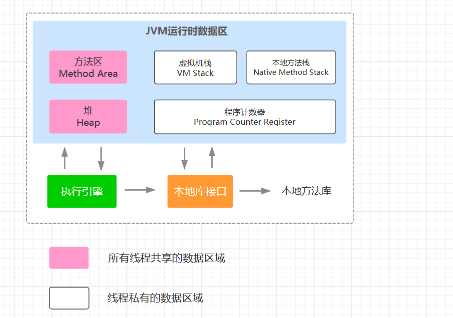
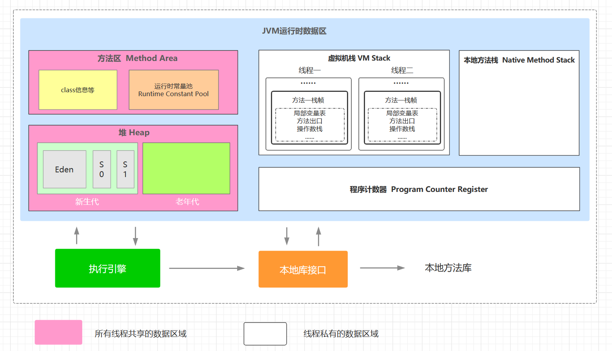

# 深入理解Java虚拟机

## 第一部分 自动内存管理机制

### 1  Java内存区域与内存溢出异常

#### 1.1 运行时数据区域

- **基本概念**

  Java本身也是个应用程序，需要占用实际物理内存，Java对自身分配到的这部分内存区域根据用途进行划分。

- **内存区域分配**

  根据《Java虚拟机规范（Java SE 7版）》规定：

  

  概述：

  - JVM将分配到的内存分为**堆、方法区、虚拟栈、本地方法栈、程序计数器** 5个基本区域（具体实际不同虚拟机、相同虚拟机的不同版本实现有差别）；
  - 线程**共享**的区域：方法区、堆；比如所有不同线程中创建的对象实例一般都存放到堆中；
  - 线程**私有**的区域：虚拟栈、本地方法栈、程序计数器；例如不同线程执行时候在虚拟机栈中会创建不同的栈实例；
  - 虚拟机执行引擎作为具体的执行者，肯定要访问内存获取存放数据了；
  - 在执行本地 Native 方法的时候会使用到本地方法栈；

- **详细内存区域分配**

  

