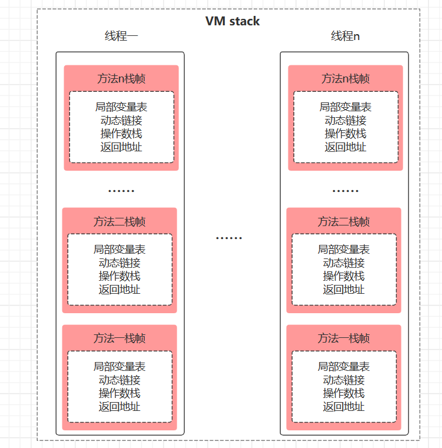
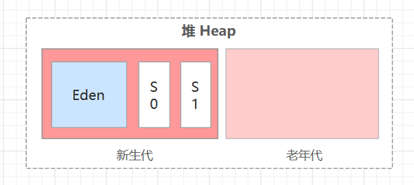

# Java内存区域与内存溢出异常

## 1  运行时数据区域

### 1.1 **基本概念**

​	Java本身也是个应用程序，需要占用实际物理内存，Java对自身分配到的这部分内存区域根据用途进行划分。

### 1.2 **内存区域分配**

​	根据《Java虚拟机规范（Java SE 7版）》规定：


- **概述**

  - JVM将分配到的内存分为**堆、方法区、虚拟栈、本地方法栈、程序计数器** 5个基本区域（具体实际不同虚拟机、相同虚拟机的不同版本实现有差别）；
  - 线程**共享**的区域：方法区、堆；比如所有不同线程中创建的对象实例一般都存放到堆中；
  - 线程**私有**的区域：虚拟栈、本地方法栈、程序计数器；例如不同线程执行时候在虚拟机栈中会创建不同的栈实例；
  - 虚拟机执行引擎作为具体的执行者，肯定要访问内存获取存放数据了；
  - 在执行本地 Native 方法的时候会使用到本地方法栈；

- **详细内存区域分配**

  

### 1.3 程序计数器

* **内容**

  * **程序计数器（Program Counter Register）**: 当前线程所执行的字节码的行号指示器，字节码解释器工作时通过改变这个计数器的值来选取下一条需要执行的字节码指令。

  * 多线程每条线程都有一个独立的程序计数器，之间互不影响，独立存储，所以说程序计数器内存区域为“线程私有内存”。

  * 如果线程正在执行的是Java方法，计数器记录的是正在执行的虚拟机字节码指令的地址；如果执行的是Native本地方法，计数器值为空（Undefined）。

  * Java虚拟机规范对此区域没有规定 OutOfMemoryError 情况，即可以任务此区域不会 OOM 。

* **理解**

  我们平时写的代码文件格式都是 **.java，会经过编译器编译成class字节码文件，虚拟机识别并读取的就是class文件。

  我们知道程序运行本质上就是通过编译后的一条条指令来调用底层操作系统等相关内容来实现的，例如计算 int  a = 1 + 3，那么这个会经过编译，高级语言编译成底层C、汇编直到最原始的二进制计算机指令，加载数据给CPU寄存器，经过运算器运算，最终数据返回到内存，内核空间返回到用户空间，在虚拟机层面进行变量赋值等操作。

  Java代码编译后的class字节码文件本质上其实就是一行行代码指令构成，例如：

  ```java
  package com.skylaker.jvm;
  
  public class TestService {
      public static void main(String[] args) {
          int a = 1 + 3;
          System.out.println("Yes , JVM !");
      }
  }
  ```

  编译后的字节码文件内容 （在IDEA中如果直接点击class文件查看其实是经过反编译的，相当于又将字节码指令翻译回源代码格式了，这里我们要直接查看class本身内容，可以安装 jclasslib 插件，也可以直接通过javap命令）:

  

  可以看到编译后的字节码指令都有对应的行号标识。只不过class字节码指令属于高级语言程序指令而已，从虚拟机层面运行肯定要依次按照设定去顺序读取这些指令（这个执行器不一样可能不同），并且程序中会有分支 if-else、跳转 break等操作，那么虚拟机如何知道下一条需要执行的指令呢，不然不是迷路了么？其实和我们用便签记录代办事项类似，当前做的、后续要做的事情我记录一下，程序计数器就是记录指令行号（更准确的说是指令地址）来确定程序执行位置。

### 1.4 Java虚拟机栈

* **内容**

  * **Java虚拟机栈（Java Virtual Machine Stacks）**：描述的是Java方法执行的内存模型，每个方法执行的同时会创建一个栈帧（Stack Frame）拥有存储局部变量表、操作数栈、动态链接、方法出口等信息，每一个方法从调用直至执行完成的过程，就对应一个栈帧在虚拟机栈中入栈到出栈的过程。

  * 线程私有区域，生命周期与线程相同。
  * Java虚拟机规范对此区域定义两种异常状况：
    * 如果线程请求的栈深度大于虚拟机所允许的深度，将抛出StackOverFlowError异常（栈溢出）；
    * 如果虚拟机栈扩展时候无法申请足够的内存，将抛出OutOfMemoryError异常（内存溢出）。

* **理解**

  我们可以先看下虚拟机栈的内存图示：

  

  我们先不用纠结这个栈帧和里面的内容，这些在后续的学习中会详细涉及。这里我们需要知道的就是线程在执行方法时候会有对应的栈帧放入自己对应的虚拟机栈中。

  我们知道Java在执行时候其实是对应的线程在执行，即使没有显式的开启线程，也会有隐式的主线程在运行。线程运行程序最直观的无非调用方法，比如从main方法开始，调用方法A，方法A又调用方法B，这么依次调用再返回。而在执行不同方法时候，一个需要给当前方法执行所需要的资源创建空间去操作，一个需要知道方法执行前后的返回路径，不至于调用了方法B，方法B执行完后不知道返回到哪个方法继续执行。前一个问题就是对应创建一个栈帧，这个栈帧直白点理解成一个内存区域，存放着我们方法中定义的局部变量等信息，第二个问题就是利用栈这个数据结构，先执行的方法栈帧在栈下面，后执行的在上面，比如A调用B，A 的栈帧在 B 栈帧下面，当 B方法执行完，那么 B 栈帧出栈，直接返回下面的栈帧对应方法执行，就是继续执行 A 方法，而不用利用一个集合啥的去到处记录谁调用谁啥的，很简便快捷。

  每个线程调用方法肯定是不同场景的，线程1调用方法 A，可能其中的变量 name 是 小花，线程 2 调用同样的方法 A，可能 变量 name 就变成 小明 了，所以每个线程需要单独分配自己的虚拟机栈运行。

### 1.5 本地方法栈

* **内容**

  * **本地方法栈（Native Method Stack）**:  作用类似虚拟机栈，只不过虚拟机栈用于执行Java方法，而本地方法栈用于虚拟机调用本地Native方法。

  * 虚拟机规范对本地方法栈的具体实现没有规定，即不同虚拟机可以自由实现，而 HotSpot虚拟机直接把本地方法栈和虚拟机栈合二为一。

  * 本地方法栈也会抛出 StackOverFlowError 和 OutOfMemoryError 异常。

### 1.6 Java堆

* **内容**

  * **Java堆（Heap）**：用于存放对象**实例**以及**数组**，在虚拟机启动时候创建，是所有线程共享的内存区域。

  * Java堆是垃圾收集器管理的主要区域，因此也被称为 **GC堆**，Java堆可以细分为新生代和老年代，采用分代垃圾收集算法。

  * Java堆中可能划分出多个线程私有的分配缓冲区（Thread Local Allocation Buffer，TLAB），但是存储的仍然是对象实例。

  * Java堆可以处于物理上不连续的内存空间中，只要逻辑上连续即可，实现时可以设置成固定大小，也可动态扩展。

  * 堆中无内存可以再分配，抛出 OutOfMemoryError异常。

* **图示**

  Java堆详细分区布局：

  

  更为详细的内容第2章节涉及。

### 1.7 方法区

### 1.8 运行时常量池

### 1.9 直接内存

## 2  HotSpot虚拟机对象

### 2.1 对象创建

### 2.2 对象内存布局

### 2.3 对象访问定位

## 3  实战内存溢出异常

### 3.1 堆溢出

### 3.2 虚拟机栈和本地方法栈溢出

### 3.3 方法区和运行时常量池溢出

### 3.4 本机直接内存溢出

