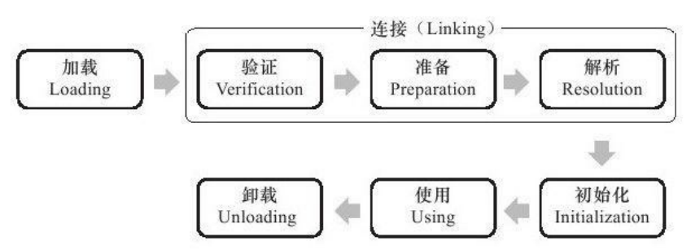
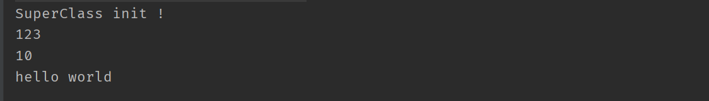
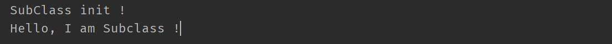
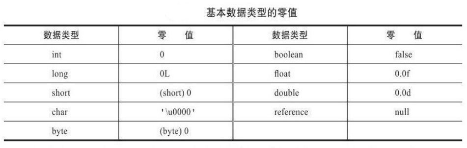

# 虚拟机类加载机制

## 1 概述

* **虚拟机类加载机制**

  虚拟机把描述类的数据从**Class文件**加载到**内存**，并对数据进行**校验**、**转换解析**和**初始化**，最终形成可以被虚拟机直接使用的 **Java 类型** 。

* **运行期加载、连接和初始化**

  在Java语言里面，类型的**加载、连接和初始化**过程都是在程序**运行期间**完成的，这种策略虽然会令类加载时稍微增加一些性能开销，但是会为Java应用程序提供高度的**灵活性**，Java里天生可以动态扩展的语言特性就是依 赖运行期动态加载和动态连接这个特点实现的。

## 2 类加载时机

### 2.1 类生命周期

* **生命周期7个阶段**

  * 加载 （Loading）
  * 连接（Linking）
    * 验证（Verification）
    * 准备（Preparation）
    * 解析（Resolution）
  * 初始化 （Initialization）
  * 使用（Using）
  * 卸载（Unloading）

  

* **交叉混合运行**

  * 加载、验证、准备、初始化和卸载这5个阶段的顺序是确定的，类的加载过程必须按照这种顺序按部就班地**开始**，这些阶段通常都是互相交叉地混合式进行的，通常会在一个阶段执行的过程中调用、激活 

    另外一个阶段；

  * 解析阶段则不一定：它在某些情况下可以在初始化阶段之后再开始，是为了支持Java语言运行时绑定；

### 2.2 **何时触发类加载**

#### 2.3.1 **5种主动引用触发加载**

Java虚拟机规范中并没有进行强制约束，但是对于**初始化**阶段，虚拟机规范则是严格规定了**有且只有5种**情况必须立即对类进行“初始化”（而加载、验证、准备自然需要在此之前开始，即也就是在这5种情况下会触发类加载），即对一个类进行**主动引用**时候：

* **1）**遇到**new**、**getstatic**、**putstatic** 或 **invokestatic **这4条字节码指令时，如果类没有进行过初始化，则需要先触发其初始化。生成这4条指令的最常见的Java代码场景是：
  * 使用 **new** 关键字**实例化对象**的时候；
  * 读取或设置类的**静态字段**（被final修饰、已在编译期把结果放入常量池的静态字段除外）的时候；
  * 调用一个类的**静态方法**的时候；
*  **2）**使用 java.lang.reflect 包的方法对类进行**反射**调用的时候，如果类没有进行过初始化，则需要先触发其初始化； 
* **3）**当初始化一个类的时候，如果发现其父类还没有进行过初始化，则需要**先触发其父类**的初始化。 
* **4）**当虚拟机启动时，用户需要指定一个要执行的**主类**（包含main（）方法的那个类），虚拟机会先初始化这个主类。 
* **5）**当使用JDK 1.7的动态语言支持时，如果一个java.lang.invoke.MethodHandle实例最后的解析结果REF_getStatic、REF_putStatic、REF_invokeStatic的方法句柄，并且这个方法句柄所对应的类没有进行过初始化，则需要先触发其初始化。 

#### 2.3.2 **被动加载例子**

```java
public class SuperClass {
    static {
        System.out.println("SuperClass init !");
    }

    public static int value = 123;
}

public class SubClass extends SuperClass{
    static {
        System.out.println("SubClass init !");
    }

    public static final String HELLOWORLD = "hello world";
}

public class ClassLoaderService {
    public static void main(String[] args) {
        // 通过子类引用父类的静态资源，不会导致子类初始化
        System.out.println(SubClass.value);

        // 通过数组定义来引用类，不会触发此类的初始化
        SubClass[] sca = new SubClass[10];
        System.out.println(sca.length);

        // 常量在编译阶段会存入调用类的常量池中，本质上并没有直接引用到定义常量的类，因此不会触发定义常量的类的初始化
        System.out.println(SubClass.HELLOWORLD);
    }
}
```

​	运行结果：

​	运行结果中没有出现子类 SubClass 初始化打印内容，因为这三种都是被动使用，非主动引用，从而触发不了类加载。

#### 2.3.3 **主动引用触发类加载**

* new 创建对象实例

  ```java
  SubClass subClass = new SubClass();
  ```

  运行结果：

  

* 读取或设置类的静态字段（非final)

  ```java
  public class SubClass extends SuperClass{
      static {
          System.out.println("SubClass init !");
      }
  
      public static  String NAME = "SUB CLASS";
  }
  
  public class ClassLoaderService {
      public static void main(String[] args) {
          // **** 主动引用：触发类加载 ****
          // 读取类的静态字段（非final）
          System.out.println(SubClass.NAME);
      }
  }
  ```

  运行结果：

  

* 调用一个类的静态方法

  ```java
  public class SubClass extends SuperClass{
      static {
          System.out.println("SubClass init !");
      }
  
      public static void info(){
          System.out.println("Hello, I am Subclass !");
      }
  }
  
  public class ClassLoaderService {
      public static void main(String[] args) {
          // **** 主动引用：触发类加载 ****
          SubClass.info();
      }
  }
  ```

  运行结果：

  

* 反射

  ```java
  public class ClassLoaderService {
      public static void main(String[] args) {
          // **** 主动引用：触发类加载 ****
          try {
              Class clazz = Class.forName(SubClass.class.getName());
          } catch (ClassNotFoundException e) {
              e.printStackTrace();
          }
      }
  }
  ```

  运行结果：

  

* 先触发其父类

  被动使用例子中子类使用父类的静态常量就触发了父类先初始化；

* 先初始化主类

  这里直接用 main 方法演示：

  ```java
  public class ClassLoaderService {
      static {
          System.out.println("MAIN");
      }
  
      public static void main(String[] args) {
          System.out.println("主类开始调用其它类");
          // **** TODO ****
      }
  }
  ```

  运行结果：

  

#### 2.3.4 **接口的触发加载**

接口与类真正有所区别的是前面讲述的5种“有且仅有”需要开始初始化场景中的第3种：

当一个类在初始化时，要求其父类全部都已经初始化过了，但是一个接口在初始化时，并不要求其父接口全部都完成了初始化，只有在真正**使用到父接口**的时候（如引用接口中定义的常量）**才会初始化** 。

## 3 类加载过程

类加载的全过程：**加载**、**验证**、**准备**、**解析**和**初始化** 5个阶段 。

### 3.1 加载

“加载”是“类加载”（Class Loading）过程的一个阶段，加载阶段，虚拟机要完成3件事情：

* 1）通过一个类的**全限定名**来获取定义此类的**二进制字节流** ；

  * 未指定具体从哪获取，虚拟机实现自由性大，例如从 jar 包获取、从网络获取、动态代理在运行时计算生成；

  * 加载阶段中获取类的二进制字节流的动作，可以使用系统提供的**引导类加载器**来完成，也可以由**用户自定义的类加载器**去完成；

  * 数组类本身不通过类加载器创建，它是由Java虚拟机直接创建的：

    * 如果数组的组件类型（ComponentType，指的是数组去掉一个维度的类型）是**引用类型**，那就递归采用本节中定义的加载过程去加载这个组件类型，数组C将在加载该组件类型的类加载器的类名称空间上被标识 ；

    * 如果数组的组件类型**不是引用类型**（例如int[]数组），Java虚拟机将会把数组C标记为与引导类加载器关联

* 2）将这个字节流所代表的**静态存储结构**转化为方法区的**运行时数据结构** ；

* 3）在内存中生成一个代表这个类的 **java.lang.Class 对象**，作为方法区这个类的各种数据的访问入口 ；
  * Class对象比较特殊，它虽然是对象，但是存放在方法区里面

### 3.2 验证

* 验证是连接阶段的第一步；

* 目的：确保Class文件的字节流中包含的信息符合当前虚拟机的要求，并且不会危害虚拟机自身的安全；

* 验证阶段的工作量在虚拟机的类加载子系统中占相当大的一部分；

* 验证阶段大致完成4个阶段的检验动作：

  * **文件格式验证**

    验证字节流是否符合Class文件格式的规范，并且能被当前版本的虚拟机处理

  * **元数据验证**

    对字节码描述的信息进行语义分析，保证描述的信息符合Java语言规范要求；

    例如：这个类是否有父类、非抽象类是否实现了其父类或接口之中要求实现的所有方法；

  * **字节码验证**

    * 通过数据流和控制流分析，确定程序语义是合法的、符合逻辑的，主要对类的方法体进行校验分析，保证被校验类的方法在运行时不会做出危害虚拟机 ；

    * 例如：保证跳转指令不会跳转到方法体以外的字节码指令上；

    * JDK1.6之后的 Javac 编译器和 Java 虚拟机利用方法体的Code属性的属性表中“StackMapTable”属性，将字节码验证的类型推导转变为类型检查从而节省验证时间；

  * **符号引用验证**

    * 发生在虚拟机将符号引用转化为直接引用的时候，即 连接的第三阶段——**解析阶段**中；

    * 目的是确保解析动作能正常执行；

    * 对类自身以外（常量池中的各种符号引用）的信息进行匹配性校验，例如：

      符号引用中通过字符串描述的全限定名是否能找到对应的类；

      符号引用中的类、字段、方法的访问性（private、protected、public、default）是否可被当前类访问；

    * 无法通过符号引用验证，那么将会抛出一个java.lang.IncompatibleClassChangeError异常的子类，如 java.lang.IllegalAccessError、j**ava.lang.NoSuchFieldError**、**java.lang.NoSuchMethodError **等；

### 3.3 准备

* 准备阶段是正式为**类变量**分配**内存**并设置类变量**初始值**的阶段，这些变量所使用的内存都将在**方法区**中进行分配；

* 进行内存分配的仅包括**类变量**（被**static**修饰的变量），而**不**包括实例变量，实例变量将会在对象实例化时随着对象一起分配在Java堆中；

* 初始值通常是数据类型的零值，Java中所有基本数据类型的零值：

  

* 例如：

  ```java
  public static int value = 123;
  ```

  * 变量value在准备阶段过后的初始值为0而不是123，因为这时候**尚未开始**执行任何Java**方法**;

  * 把value赋值为 123 的 **putstatic** 指令是程序被编译后，存放于类构造器**＜clinit＞()**方法之中，所以把value赋值为 123 的动作将在**初始化**阶段才会执行；

* 如果类字段的字段属性表中存在ConstantValue属性，那在准备阶段变量value就会被初始化为ConstantValue属性所指定的值，即一般被 final 修饰的变量：

  ```java
  public static final int value = 123;
  ```

  编译时 Javac 将会为 value 生成 ConstantValue 属性，在**准备**阶段虚拟机就会根据ConstantValue的设置将value赋值为 123 ；

### 3.4 解析

* 主要内容：虚拟机将常量池内的**符号引用**替换为**直接引用**；

  直白点比如说代码中定义的某个实例对象引用变量，因为程序还未实际运行，那么这个对象实例还没创建，这个引用自然无法在编译阶段知道目标对象地址，那么就先用个符号形式表示下，等实际在虚拟机加载运行的时候，对应对象创建了，那么就可以将引用实际指向目标地址了；

* **符号引用**（Symbolic References）：符号引用以一组**符号**来描述所**引用的目标**，符号可以是任何形式的字面量，只要使用时能无歧义地定位到目标即可；

* **直接引用**（Direct References）：可以是直接指向目标的**指针**、**相对偏移量**或是一个能间接定位到目标的**句柄**；

* 虚拟机规范未规定解析阶段发生的具体时间，只要求了在执行以下16个用于 操作符号引用的字节码指令之前，先对它们所使用的符号引用进行解析：

  ```java
  anewarray、checkcast、getfield、getstatic、instanceof、invokedynamic、invokeinterface、invokespecial、invokestatic、invokevirtual、ldc、ldc_w、multianewarray、new、putfield、utstatic 
  ```

  虚拟机实现可在类被**加载器加载时**就对常量池中的符号引用进行解析，或等到一个符号引用**将要被使用前**才去解析；

* 解析动作主要针对 `类或接口、字段、类方法、接口方法、方法类型、方法句柄和调用点限定符` 7类符号引用进行，分别对应于常量池 7种常量类型 ：

  ```java
  CONSTANT_Class_info、CONSTANT_Fieldref_info、CONSTANT_Methodref_info、 
  
  CONSTANT_InterfaceMethodref_info、CONSTANT_MethodType_info、 
  
  CONSTANT_MethodHandle_info、CONSTANT_InvokeDynamic_info
  ```

### 3.5 初始化

* 到初始化阶段，才真正开始**执行**类中定义的**Java程序代码**（或者说是字节码）；

* 在初始化阶段，根据程序员通过程序制定的主观计划去初始化类变量和其他资源，换种说法：

  初始化阶段是执行类构造器**＜clinit＞()** 方法的过程 ;

* ＜clinit＞() 特点和细节：
  * **类变量赋值动作、静态语句块合成**；

    ＜clinit＞() 方法是由编译器自动收集类中的所有类变量的赋值动作和静态语句块 （static{}块）中的语句合并产生；

    编译器收集的顺序是由语句在源文件中出现的顺序所决定的，静态语句块中只能访问到定义在静态语句块之前的变量；定义在它之后的变量，在前面的静态语句块可以赋值，但是不能访问 ;

  ```java
  public class InitVariable {
      static {
          i = 1;  // 给后边的类变量赋值可以编译通过
          System.out.println(i); // Error:(10, 28) java: 非法前向引用
      }
  
      static int i = 0;
  }
  ```

  * **父类优先子类执行**；

    ＜clinit＞() 方法与类的构造函数（或者说实例构造器＜init＞（）方法）不同，不需要显式地调用父类构造器，虚拟机会保证在子类的＜clinit＞() 方法执行之前，父类的＜clinit＞() 方法已经执行完毕。因此在虚拟机中第一个被执行的＜clinit＞() 方法的类肯定是 java.lang.Object ；

  * **不是必需**；

    ＜clinit＞() 方法对于类或接口来说并不是必需的，如果一个类中没有静态语句块，也没有对变量的赋值操作，那么编译器可以不为这个类生成＜clinit＞() 方法；

  * **接口也可生成** ；

    接口中不能使用静态语句块，但仍然有变量初始化的赋值操作，因此接口与类一样都会生成＜clinit＞（）方法；接口与类不同的是，执行接口的＜clinit＞（）方法不需要先执行父接口的＜clinit＞（）方法；

    只有当父接口中定义的变量使用时，父接口才会初始化；

    接口的实现类在初始化时也一样不会执行接口的＜clinit＞（）方法 ；

  * **只执行一次**；

    虚拟机会保证一个类的＜clinit＞（）方法在多线程环境中被正确地加锁、同步；

    如果多个线程同时去初始化一个类，那么只会有一个线程去执行这个类的＜clinit＞（）方法，其他线程都需要阻塞等待，直到活动线程执行＜clinit＞（）方法完毕；

    如果在一个类的＜clinit＞（）方法中有耗时很长的操作，就可能造成多个进程阻塞；

