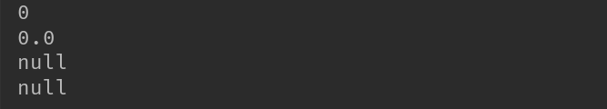
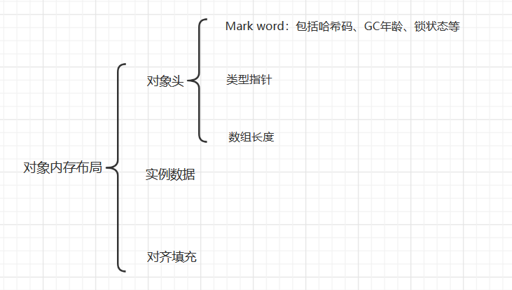
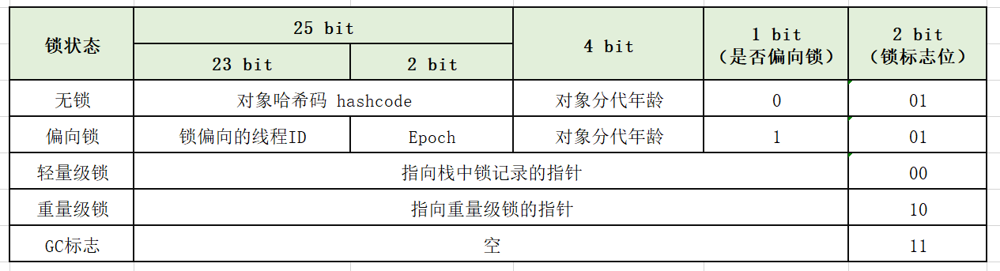
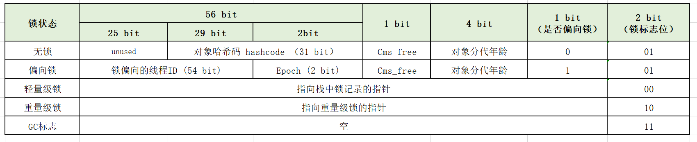
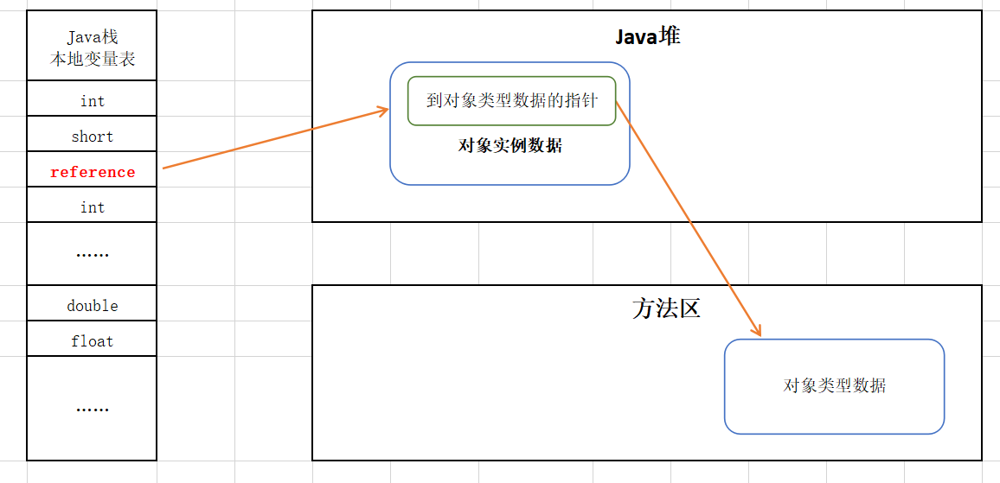

## HotSpot虚拟机对象

### 1 对象创建

#### 1.1 **基本流程**


#### 1.2 **过程详细描述**

- 语言层面创建一个普通对象一般通过 new 关键字，例如 

  ```java
  TestService service = new com.skylaker.jvm.TestService();
  ```

- **首先检查这个指令的参数是否能在常量池中定位到一个类的符号引用**。

  其实直白点理解就是，我要去创建一个类的对象实例，比如上面这个写法，那总得先存在这个类的定义吧，不然如何创建？皮之不存，毛将焉附？

- **没有被加载过，就需要先执行类加载**。

  比如说上面这个代码要去创建 TestService 类的实例，但是常量池中并不存在这个类的字节码文件内容，那么就需要类加载器将我们源代码编译后的字节码文件 TestService.class 文件加载到虚拟机内存的方法区中，这样才能知道这个类定义的相关信息，从而去创建对象。

- **类加载检查通过后，虚拟机为新生的对象分配内存**。

  为对象分配空间的任务等同于把一块确定大小的内存从Java堆中划分出来。两种方式：指针碰撞、空闲列表：
  
- **指针碰撞（Bump the Pointer）**: 假设 Java 堆中内存是绝对规整的，所有用过的内存都放到一边，空闲的内存放到另一边，中间放着与i个指针作为分界点的指示器，那所分配内存就仅仅是把那个指针向空闲那边挪动一段与对象大小相等的距离。
  - **空闲列表（Free List）**：如果堆中的内存并不规整，已使用的内存和空闲的内存相互交错，虚拟机需要维护一个列表，记录哪些内存块是可用的，再分配的时候从列表中找到一个足够大的空间划分给对象实例，并更新列表上的记录。

  而具体哪种方式取决于Java堆**是否规整**，而堆是否规整由采用的**垃圾收集器**是否带有**压缩整理**功能决定。例如使用 Serial、ParNew 等带 Compant 过程的收集器时，系统采用指针碰撞算法，而使用 CMS 这种基于 Mark-Sweep（标记清除）算法时候采用空闲列表算法（因为标记清除算法不进行空间整理，会产生空间碎片，不是规整的内存，所有不好用指针碰撞算法）。
  
  
  
  **对象创建线程安全问题**：例如修改一个指针指向的位置，并发情况下可能出现正在给对象 A 分配内存，指针还未来得及修改，对象 B 使用了原本 A 要使用的内存。解决方案有两种：
  
  * 对分配内存空间的动作进行**同步**处理；
  * 把内存分配的动作按照线程划分再**不同的空间**之中，即每个线程在 Java堆中预先分配一小块内存——称为**本地线程分配缓冲（Thread Local Allocation Buffer，TLAB）**。哪个线程要分配，就在哪个线程的 TLAB 上分配。
  
  其实这个解决方案就是类似解决并发冲突的手段，一种直接加锁控制，一种不共享变量，每个线程单独操作自己的变量，也就不存在线程安全问题了。

* **内存分配完成，虚拟机将分配到的内存空间都初始化为零值（不包括对象头）**。

  保证对象实例字段在 Java 代码种可以不赋初始值就能直接使用，程序能访问到字段数据类型对应零值。

  这个其实例如：`int a = 3;`    a 变量被 赋值为 3，但在这一步先分配变量为对应的 int 类型的初始值 0 。我们程序种可以这样定义变量：

  ```java
  public class TestService {
      private static int a;
      private static double b;
      private static String name;
      private static Integer age;
  
      public static void main(String[] args) {
          System.out.println("Yes , JVM !");
  
          System.out.println(a);
          System.out.println(b);
          System.out.println(name);
          System.out.println(age);
      }
  }
  ```

  输出：

  

  可以看到即使我们没有显示赋值变量的值，变量本身也会被赋值对应的数据类型初始值，例如 int 类型默认值 0 , 对象类型默认初始值 null 。

* **对对象进行必要的设置**。

  包括对象头（Object Header）信息的设置，例如这个对象是哪个类实例、如何找到类的元数据信息、对象的哈希码、对象的GC分代年龄信息。

* **执行<init>方法，把对象按照程序的设置进行初始化**，例如 `int a = 3;`   将 a 变量赋值对应的 3 , 这样一个真正的可用对象才算完全产生出来。

### 2 对象内存布局

#### 2.1 **基本组成**

HotSpot虚拟机种，对象内存存储的布局分为三块：对象头（Header）、实例数据（Instance Data）和对齐填充（Padding），如下所示：



#### 2.2 对象头（Header）

* **Mark Word**

  * 存储对象自身的运行时数据，例如哈希码、GC分代年龄、锁状态、线程持有的锁等。在32位和64位虚拟机（未开启指针压缩）种分别为 32位、64位。非固定数据结构，在不同状态下复用存储空间，以便存储更多信息。（直白点理解就是相同位置的内存空间在不同状态下存储不同的数据，对象头在不同的锁状态下记录的是不同的数据内容）

  * 32位HotSpot虚拟机中对象头结构

    

  * 64位HotSpot虚拟机中对象头结构：

    

  * 这里简单说下锁相关的内容，我们在遇到并发共享资源操作时候会采用 synchronized 关键字来进行加锁同步，保证多线程操作的场景下安全性。我们使用 sychronized 时候会怎么用呢？会直接定义一个对象做为锁，或者修饰方法时候默认采用当前对象实例作为锁：

    ```java
     // 同步方法
     public synchronized void getData(){
         // TODO
         System.out.println("操作数据成功！");
     }
    
    
     private static final Object lock = new Object();
    
     public void getData2(){
        // 同步代码块
        synchronized (lock) {
            // TODO
            System.out.println("操作数据成功！");
        }
     }
    ```

    其实不论哪种方式，作为锁的都是对象实例，而为什么对象可以作为锁呢，从上面对象头的布局可以看到，对象头中存储了锁状态的信息，方便线程同步时候去存储获取相关的信息，比如线程 A 和线程 B 同时用对象 O 作为锁，对象 A 在先进入临界区的时候先获取到了锁，那么对象 O 就标识了当前处于锁状态，那么线程 B 在准备进入临界区操作的时候发现已经锁住了，那么就需要进入等待状态；又比如线程执行时，如果当前是偏向锁，那么可以知道锁更倾向于哪个线程ID。

    我们总是说 synchronized 重量级锁，性能差，相比采用 Lock 锁等，其实这个说法并不准确，Java层面在 Java SE 1.6 之后对 synchronized 进行优化，针对不同场景下采用不同的锁策略，这样避免直接任意情况下都直接使用重量级锁，提升了性能。锁从偏向锁可以升级到轻量级锁，再升级到重量级锁。具体锁的优化升级等内容这边我们不做详细讨论，后续专门谈并发再讲。

  * 在对象头中我们可以看到对象分代年龄占用 4 比特位，这个因为垃圾回收时默认的新生代中对象升级到老年代对象需要的默认年龄大小 15，二进制即 1111，即占用 4 比特位。

* **类型指针（Instance Data）**

  对象指向它的类元数据的指针，虚拟机通过这个指针来确定这个对象是哪个类的实例。

* **数组长度**

  如果对象是一个数组，那么对象头中还必须有一块用于记录数组长度的数据。因为Java对象大小可以通过对象元数据信息确定，但是数组的元数据无法确定数组大小。

#### 2.3 实例数据

对象真正存储的有效信息，程序代码中定义的各种类型的字段内容，包括子类定义的、从父类继承的。

#### 2.4 对齐填充

对齐填充不是必须存在的，也无特殊含义，仅起到占位符作用。HotSpot 虚拟机要求对象起始地址必须时8字节整数倍，即对象大小要是8字节的整数倍，而对象头正好8的倍数（要么1倍要么2倍，例如下面的计算内容）：

* 在32位系统下，MarkWord是4字节，对象头为8字节；

* 在64位系统下，MarkWord是8字节，对象头为16字节；

* 数组长度4字节 + 数组对象头8字节 + 对齐4 = 16字节；

所以对象实例数据部分没有对齐时候，就需要对齐填充来补全。

对齐填充的本身目的也是为了存储、计算方便。其实对齐填充简单的理解就是，本来我这个数据只需要占用 3 字节长度，但是你非要 8 字节倍数，那咋办，好比字符串长度位数不够前面补零拼接一样，直接前面缺少长度空位 0 值补充（这里只是简单的理解，不一定准确）。

### 3 对象访问定位

* **对象访问方式**

  建立对象是为了使用对象，Java程序需要通过栈上的reference数据来操作堆上的具体对象。对象引用访问对象的方式有两种：

  * **句柄访问**

    Java堆中划分出一块内存作为句柄池，reference中存储的就是对象的句柄地址，而句柄中包含了对象实例数据与类型数据各自具体信息。

    

  * **直接指针**

    使用直接指针访问，堆中对象需要放置访问类型数据的相关信息，而reference中存储的直接就是对象地址。

    

* **两种方式优缺点**

  * 句柄访问

    reference中存储的是稳定的句柄地址，对象被移动时候（例如垃圾回收）只需要改变句柄中实例数据指针，而reference本身不需要改变。但是reference访问对象需要经过二次追踪，影响效率。

  * 直接指针

    速度更快，减少一次指针定位的时间开销。HotSpot采用直接指针方式访问。但是对象地址变化需要引用也更新保存的对象地址信息。

* **理解**

  其实这个就和存钱似的，我们可以把一百块放自己身上，也可以把钱村银行，当我们需要花钱时候，要是自己身上直接掏出即可，要是在银行还需要去ATM取下钱，就是多了一个代理人，自然效率要低了。

  对象引用在虚拟机栈中，对象在堆中，可以直接采用直接指针方式引用指向对象本身，这样要想访问到对象一下子就能访问到，不过对象本身的一些类定义信息就需要绑定在对象自身内部了。采用句柄方式的话相当于一个管家，它管理每个对象实例数据和类定义的相关数据信息，栈中对象引用要想访问对象需要询问这个管家——句柄池，句柄池告诉引用要访问的对象地址，然后二次追踪才能访问到对象。不过对象总是会经历垃圾回收，可能从新生代 Eden区到 S0、S1区，又到老年代，对象在内存的位置发生变化，那么指向自己的引用或者句柄池也要更新保存的实例对象地址，采用句柄池方式自然句柄池更新这个指向地址即可，引用reference本身不需要管，自己要想访问对象直接找句柄池即可，而直接指针方式自然引用reference需要去更新自己保存的指向对象地址。