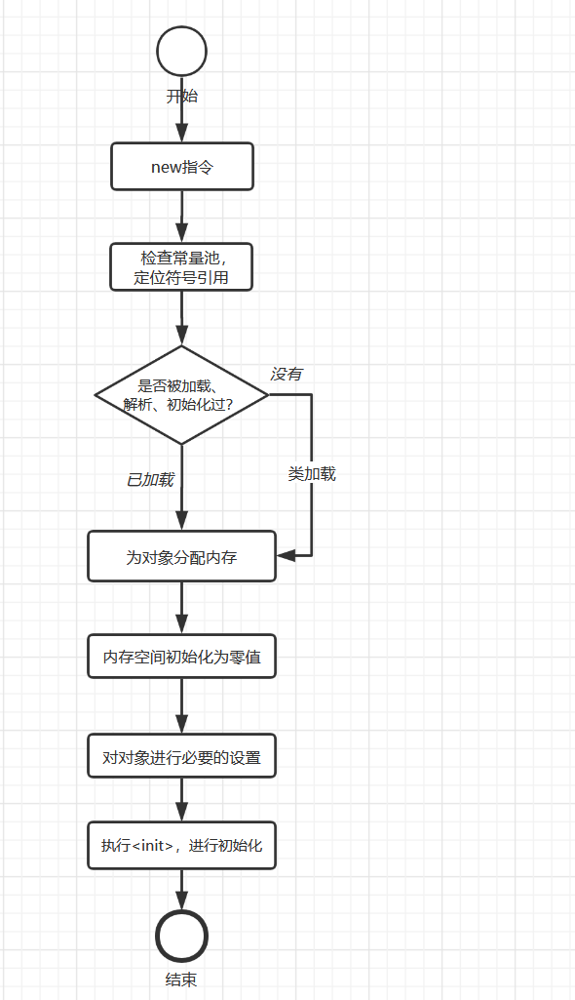

## HotSpot虚拟机对象

### 1 对象创建

- **基本流程**



- **过程详细描述**

  - 语言层面创建一个普通对象一般通过 new 关键字，例如 

    ```java
    TestService service = new com.skylaker.jvm.TestService();
    ```

  - **首先检查这个指令的参数是否能在常量池中定位到一个类的符号引用**。其实直白点理解就是，我要去创建一个类的对象实例，比如上面这个写法，那总得先存在这个类的定义吧，不然如何创建？皮之不存，毛将焉附？

  - **没有被加载过，就需要先执行类加载**。比如说上面这个代码要去创建 TestService 类的实例，但是常量池中并不存在这个类的字节码文件内容，那么就需要类加载器将我们源代码编译后的字节码文件 TestService.class 文件加载到虚拟机内存的方法区中，这样才能知道这个类定义的相关信息，从而去创建对象。

  - **类加载检查通过后，虚拟机为新生的对象分配内存**。为对象分配空间的任务等同于把一块确定大小的内存从Java堆中划分出来。有两种方式：指针碰撞、空闲列表。

    - 指针碰撞（Bump the Pointer）: 假设 Java 堆中内存是绝对规整的，所有用过的内存都放到一边，空闲的内存放到另一边，中间放着与i个指针作为分界点的指示器，那所分配内存就仅仅是把那个指针向空闲那边挪动一段与对象大小相等的距离。
    - 空闲列表（Free List）：如果堆中的内存并不规整，已使用的内存和空闲的内存相互交错，虚拟机需要维护一个列表，记录哪些内存块是可用的，再分配的时候从列表中找到一个足够大的空间划分给对象实例，并更新列表上的记录。

    而具体哪种方式取决于Java堆是否规整，而堆是否规整由采用的垃圾手机器是否带有压缩整理功能决定。例如使用 Serial、ParNew 等带 Compant 过程的收集器时，系统采用指针碰撞算法，而使用 CMS 这种基于 Mark-Sweep（标记清除）算法时候采用空闲列表算法。

    对象创建线程安全问题：

### 2 对象内存布局

### 3 对象访问定位