## 实战：OutOfMemoryError异常

#### 1 简述

Java虚拟机规范，除了程序计数器外，虚拟机内存的其它几个运行时数据区域都有可能发生 OutOfMemoryError异常的可能。

#### 2 工具准备

* 内存溢出分析工具

  为了分析 OOM 后的内存转储快照文件，我们用 Eclipse Memory Analyzer 这个工具：https://www.eclipse.org/mat/，下载完成之后，我们设置下，因为一般内存溢出后尤其堆内存溢出，快照文件很大，所以为了避免查看分析时候内存不足，调大 MAT 的内存设置：

  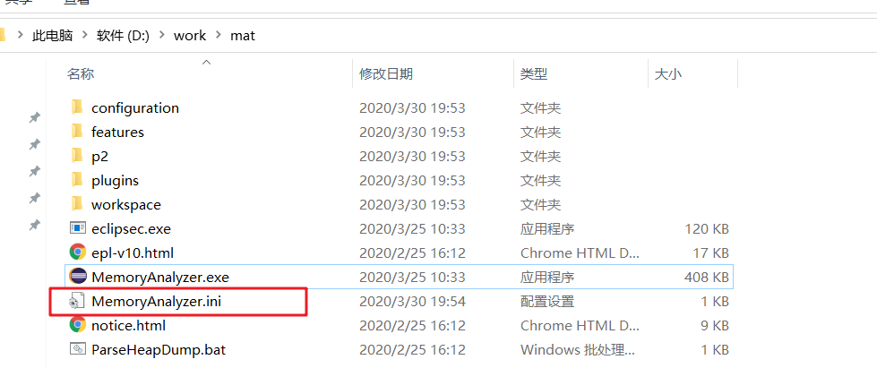

  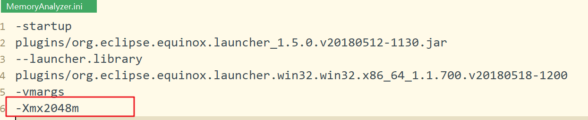

* 开发工具

  IDEA

* JDK版本

  1.8，64位 ，特定场景采用1.7、1.6，会有特殊说明。

#### 2 堆溢出

##### 2.1 简述

Java堆用于存储对象实例，要模拟堆内存溢出异常，那么就需要创建大量对象达到最大堆的容量限制，并且同时为了避免垃圾回收需要保证 GC Roots 到对象之间有可达路径。

##### 2.2 测试代码

```java
package com.skylaker.jvm.rtda;

import java.util.ArrayList;
import java.util.List;

/**
 * 模拟堆内存溢出
 * @author skylaker
 * @version V1.0 2020/3/30 19:45
 */
public class HeapOOM {
    static class  OOMObject {

    }

    public static void main(String[] args) {
        List<OOMObject> list = new ArrayList<>();

        while (true) {
            list.add(new OOMObject());
        }
    }
}
```

同时 IDEA 设置当前应用堆内存参数：**-Xms20m  -Xmx20m  -XX:+HeapDumpOnOutOfMemoryError**

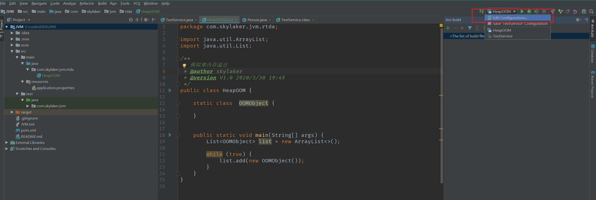

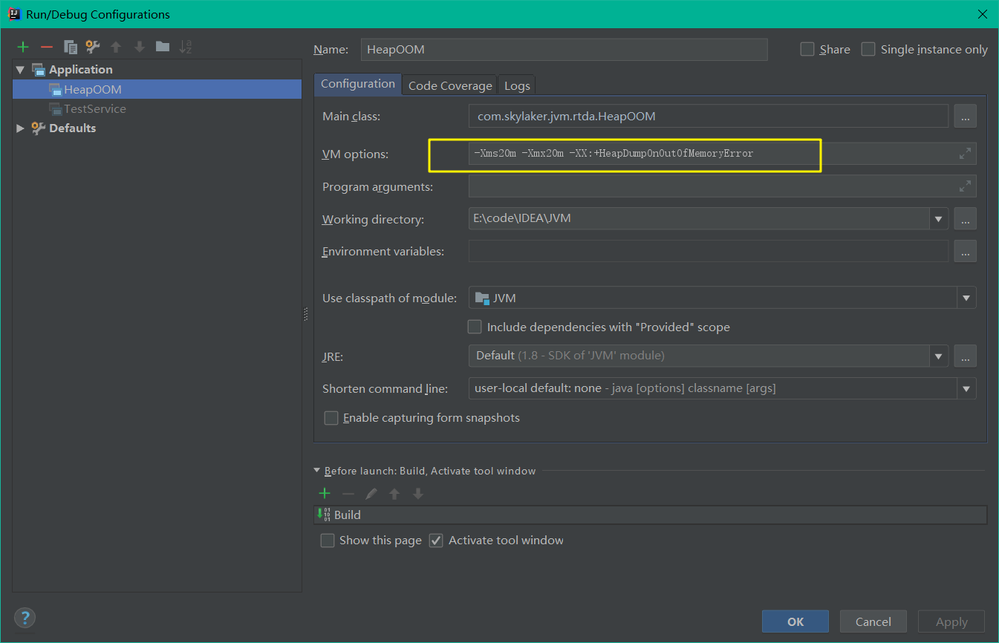

即堆内存最大最小都是20M，固定大小，同时  **-XX:+HeapDumpOnOutOfMemoryError** 设置当虚拟机出现内存溢出异常时Dump出当前内存堆转储快照，这里没有设置保存文件路径，默认在当前工程目录下生成。

我们运行上述代码：

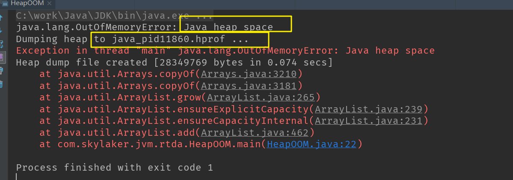

可以看到提示堆内存溢出异常，并且生成了堆内存转储文件，我们去工程目录下可以看到：

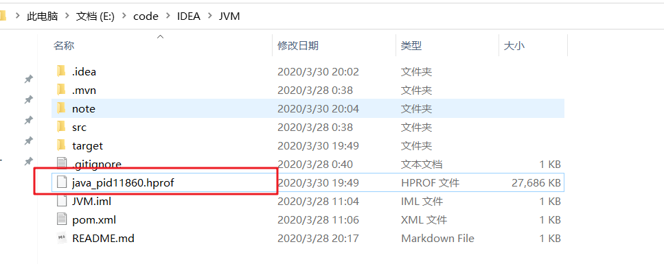

##### 2.3 分析

利用 MAT 打开内存转储快照文件，不过最好复制到一个单独目录，因为会生成很多临时文件：

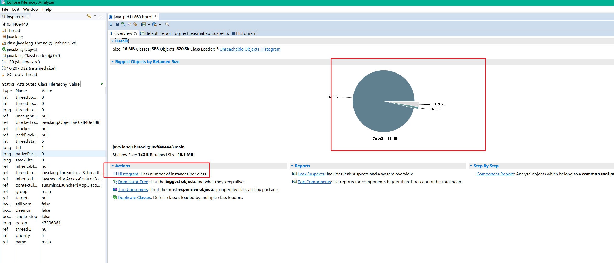

查看统计：

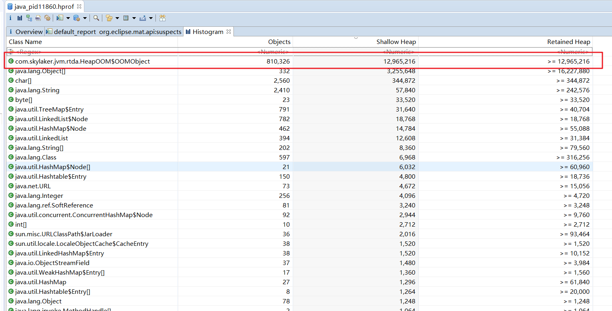

很清晰的列出了占用堆内存最大的对象。

##### 2.4 处理

这里我们查找到内存溢出情况后，需要根据实际情况进行处理：

* **内存泄漏**

  这种情况直白点说就是对象实例确实不应该大量存在，因为代码问题导致对象大量产生造成OOM，那么就需要利用 MAT 等工具进一步分析定位产生的问题代码，并进行处理，比如上面 MAT 中我们首页点击：Leak Suspects 进行内存泄漏排查：

  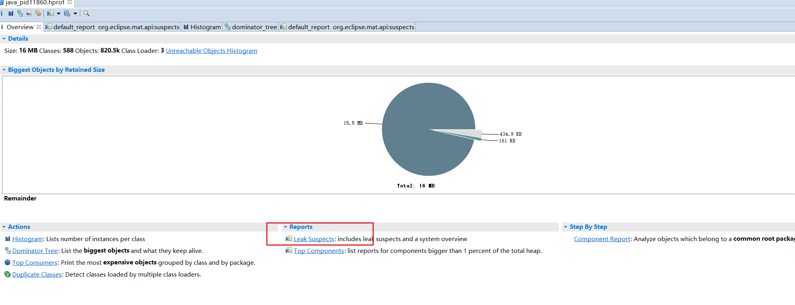

  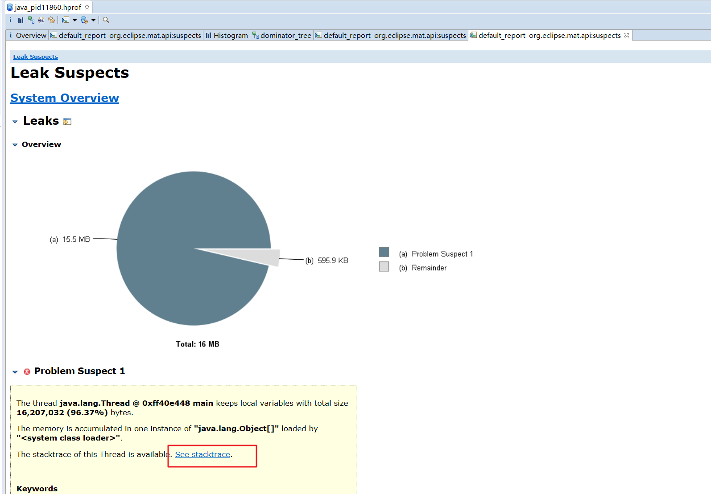

   

   进一步查看堆栈跟踪信息：

  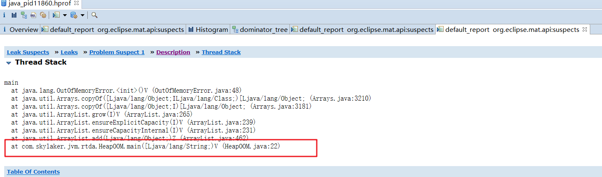

   可以看到列出了内存泄漏问题代码处。

* **非内存泄漏**

  如果说发生了 OOM ，但是经过排查对象确实应该需要存在，确实很占用内存，那么就需要考虑是不是应用内存设置太小了，那么就通过 -Xms  -Xmx 等参数调大应用内存。

#### 3 虚拟机栈和本地方法栈溢出

##### 3.1 简述

HotSpot 虚拟机虚拟机栈和本地方法栈合二为一，设置本地方法栈大小 -Xoss 实际无效，栈容量只由 -Xss 设定。

虚拟机栈和本地方法栈，虚拟机描述了两种异常：

* **StackOverflowError异常**

  如果线程请求的栈深度大于虚拟机所允许的最大深度（这里没有说请求的栈帧个数太多，而是线程虚拟机栈中存在的栈帧占用内存太大，导致栈空间不够），将抛出栈溢出异常；

* **OutOfMemoryError异常**

  如果虚拟机在扩展时候无法申请到足够的内存空间，则抛出OOM异常；

两种异常存在重叠，本质上对同一件事的两种描述，例如栈空间不够继续分配，到底是因为已分配栈空间太大还是因为内存太小？

##### 3.2 测试代码

```java
package com.skylaker.jvm.rtda;

/**
 * HotSpot 虚拟机栈（和本地方法栈）溢出异常测试
 *
 *  VM 参数设置 -Xss128k
 *
 * @author skylaker
 * @version V1.0 2020/3/30 20:33
 */
public class StackSOF {
    private int stackLength = 1;

    /**
     * 这里通过递归循环调用自身，造成大量方法栈栈入栈
     */
    public void stackLeak(){
        stackLength++;
        stackLeak();
    }

    public static void main(String[] args) {
        StackSOF stackSOF = new StackSOF();

        try{
            stackSOF.stackLeak();
        } catch (Throwable e){
            System.out.println("当前栈深度：" + stackSOF.stackLength);
            throw e;
        }
    }
}
```

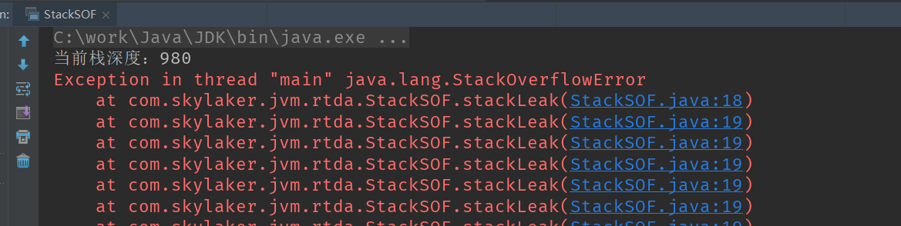

我们也可以在方法中定义多个局部变量，这样增大单个栈帧大小，那么能够入栈的栈帧数量必然减少：

```java
public void stackLeak(){
    int a = 0;
    int b = 0;
    int c = 0;
    int d = 0;
    stackLength++;
    stackLeak();
}
```

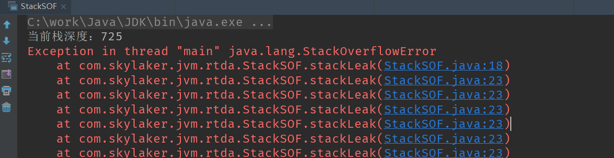


测试结果：

* 单个线程下，无论栈帧太大，还是虚拟机栈容量太小，当内存无法分配时候，都抛出 StackOverflowError 异常；
* 多线程环境下，创建大量的线程可以出现 OOM 异常，但是和栈空间是否足够大无任何关系，因为线程本身需要占用内存，大量线程必然导致进程内存枯竭，导致 OOM 异常。