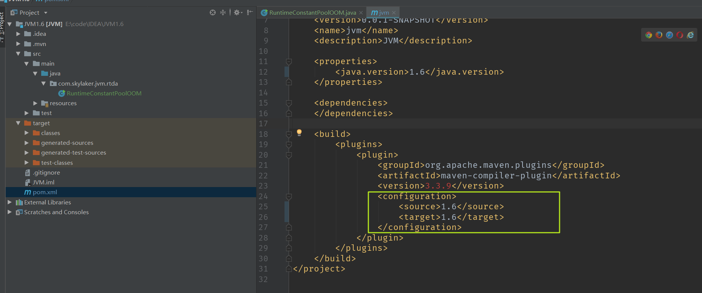

## 实战：OutOfMemoryError异常

#### 1 简述

Java虚拟机规范，除了程序计数器外，虚拟机内存的其它几个运行时数据区域都有可能发生 OutOfMemoryError异常的可能。

#### 2 工具准备

* 内存溢出分析工具

  为了分析 OOM 后的内存转储快照文件，我们用 Eclipse Memory Analyzer 这个工具：https://www.eclipse.org/mat/，下载完成之后，我们设置下，因为一般内存溢出后尤其堆内存溢出，快照文件很大，所以为了避免查看分析时候内存不足，调大 MAT 的内存设置：

  

  

* 开发工具

  IDEA

* JDK版本

  1.8，64位 ，特定场景采用1.7、1.6，会有特殊说明。

#### 2 堆溢出

##### 2.1 简述

Java堆用于存储对象实例，要模拟堆内存溢出异常，那么就需要创建大量对象达到最大堆的容量限制，并且同时为了避免垃圾回收需要保证 GC Roots 到对象之间有可达路径。

##### 2.2 测试代码

```java
package com.skylaker.jvm.rtda;

import java.util.ArrayList;
import java.util.List;

/**
 * 模拟堆内存溢出
 * @author skylaker
 * @version V1.0 2020/3/30 19:45
 */
public class HeapOOM {
    static class  OOMObject {

    }

    public static void main(String[] args) {
        List<OOMObject> list = new ArrayList<>();

        while (true) {
            list.add(new OOMObject());
        }
    }
}
```

同时 IDEA 设置当前应用堆内存参数：**-Xms20m  -Xmx20m  -XX:+HeapDumpOnOutOfMemoryError**


即堆内存最大最小都是20M，固定大小，同时  **-XX:+HeapDumpOnOutOfMemoryError** 设置当虚拟机出现内存溢出异常时Dump出当前内存堆转储快照，这里没有设置保存文件路径，默认在当前工程目录下生成。

我们运行上述代码：


可以看到提示堆内存溢出异常，并且生成了堆内存转储文件，我们去工程目录下可以看到：


##### 2.3 分析

利用 MAT 打开内存转储快照文件，不过最好复制到一个单独目录，因为会生成很多临时文件：


查看统计：


很清晰的列出了占用堆内存最大的对象。

##### 2.4 处理

这里我们查找到内存溢出情况后，需要根据实际情况进行处理：

* **内存泄漏**

  这种情况直白点说就是对象实例确实不应该大量存在，因为代码问题导致对象大量产生造成OOM，那么就需要利用 MAT 等工具进一步分析定位产生的问题代码，并进行处理，比如上面 MAT 中我们首页点击：Leak Suspects 进行内存泄漏排查：

  

  

   

   进一步查看堆栈跟踪信息：

  

   可以看到列出了内存泄漏问题代码处。

* **非内存泄漏**

  如果说发生了 OOM ，但是经过排查对象确实应该需要存在，确实很占用内存，那么就需要考虑是不是应用内存设置太小了，那么就通过 -Xms  -Xmx 等参数调大应用内存。

#### 3 虚拟机栈和本地方法栈溢出

##### 3.1 简述

HotSpot 虚拟机虚拟机栈和本地方法栈合二为一，设置本地方法栈大小 -Xoss 实际无效，栈容量只由 -Xss 设定。

虚拟机栈和本地方法栈，虚拟机描述了两种异常：

* **StackOverflowError异常**

  如果线程请求的栈深度大于虚拟机所允许的最大深度（这里没有说请求的栈帧个数太多，而是线程虚拟机栈中存在的栈帧占用内存太大，导致栈空间不够），将抛出栈溢出异常；

* **OutOfMemoryError异常**

  如果虚拟机在扩展时候无法申请到足够的内存空间，则抛出OOM异常；

两种异常存在重叠，本质上对同一件事的两种描述，例如栈空间不够继续分配，到底是因为已分配栈空间太大还是因为内存太小？

##### 3.2 测试代码

```java
package com.skylaker.jvm.rtda;

/**
 * HotSpot 虚拟机栈（和本地方法栈）溢出异常测试
 *
 *  VM 参数设置 -Xss128k
 *
 * @author skylaker
 * @version V1.0 2020/3/30 20:33
 */
public class StackSOF {
    private int stackLength = 1;

    /**
     * 这里通过递归循环调用自身，造成大量方法栈栈入栈
     */
    public void stackLeak(){
        stackLength++;
        stackLeak();
    }

    public static void main(String[] args) {
        StackSOF stackSOF = new StackSOF();

        try{
            stackSOF.stackLeak();
        } catch (Throwable e){
            System.out.println("当前栈深度：" + stackSOF.stackLength);
            throw e;
        }
    }
}
```


我们也可以在方法中定义多个局部变量，这样增大单个栈帧大小，那么能够入栈的栈帧数量必然减少：

```java
public void stackLeak(){
    int a = 0;
    int b = 0;
    int c = 0;
    int d = 0;
    stackLength++;
    stackLeak();
}
```


测试结果：

* 单个线程下，无论栈帧太大，还是虚拟机栈容量太小，当内存无法分配时候，都抛出 StackOverflowError 异常；
* 多线程环境下，创建大量的线程可以出现 OOM 异常，但是和栈空间是否足够大无任何关系，因为线程本身需要占用内存，大量线程必然导致进程内存枯竭，导致 OOM 异常。

#### 4 方法区和运行时常量池溢出

##### 4.1 简述

运行时常量池是方法区一部分，所以我们直接通过频繁创建运行时常量池中的对象来测试方法区 OOM溢出。

##### 4.2 **测试代码**

```java
package com.skylaker.jvm.rtda;

import java.util.ArrayList;
import java.util.List;

/**
 * 运行时常量池内存溢出测试
 *
 *  VM参数设置： -XXPermSize=10M -XX:MaxPermSize=10M
 * 分别在 JDK1.6、JDK1.7 和 JDK1.8 环境下运行
 *
 * @author skylaker
 * @version V1.0 2020/3/30 20:56
 */
public class RuntimeConstantPoolOOM {
    public static void main(String[] args) {
        // 这里List保持对常量池中字符串常量引用，避免 Full GC 时候回收常量池
        List<String> list = new ArrayList<String>();

        // 这里循环产生字符串，而 i 变量是有范围的，Integer 范围内，
        // 不过这个范围内产生的字符串数量足够超出方法区 10M 的限制
        int  i = 0;
        while (true){
            list.add(String.valueOf(i++).intern());
        }
    }
}
```

##### 4.3 运行测试

这里我们在不同的 JDK 环境下测试：

###### 4.3.1  **JDK 1.6**

JDK1.6环境运行： 虚拟机参数  **-XX:PermSize=10M  -XX:MaxPermSize=10M**，限制方法区大小为 10M


这里说下在 1.6 环境下运行，我们需要单独下载下 JDK1.6，然后 IDEA 配置下相关编译运行环境：


如果maven指定了 JDK 编译版本也改下：




###### 4.3.2  **JDK 1.7**

JDK1.7 运行，还是设置虚拟机参数  **-XX:PermSize=10M  -XX:MaxPermSize=10M**，限制方法区大小为 10M，结果在 int 数值范围内一直运行：


但是我们把虚拟机参数设置为：**-Xms10m -Xmx10m -XX:+HeapDumpOnOutOfMemoryError**，即限制堆内存的大小，结果：


发生了 OOM 异常，而这个异常原因是因为 GC overhead limit ，Oracle官方解释：

```java
Exception in thread thread_name: java.lang.OutOfMemoryError: GC Overhead limit exceeded
Cause: The detail message "GC overhead limit exceeded" indicates that the garbage collector is running all the time and Java program is making very slow progress. After a garbage collection, if the Java process is spending more than approximately 98% of its time doing garbage collection and if it is recovering less than 2% of the heap and has been doing so far the last 5 (compile time constant) consecutive garbage collections, then a java.lang.OutOfMemoryError is thrown. This exception is typically thrown because the amount of live data barely fits into the Java heap having little free space for new allocations.
Action: Increase the heap size. The java.lang.OutOfMemoryError exception for GC Overhead limit exceeded can be turned off with the command line flag -XX:-UseGCOverheadLimit.
```

这个是指 GC占用了大量时间，垃圾收集器一直在努力的收集垃圾，释放内存，但是努力了几次花费了大量时间后发现实际释放的内存很少，感觉努力没啥作用呢，算了放弃吧，就会报出这个异常。

那这里为啥报这个呢？这个正是因为在 **JDK1.7 中运行时常量池移到了堆内存中**，我们限制了堆内存大小，程序中不停的创建对象，但是又因为又List集合引用，导致垃圾收集器判断这些并非是垃圾，导致回收不了，最终导致不管怎么努力回收都无济于事。

我们可以查看下堆内存转储快照文件：


可以看到大量的字符串类型数据，同时通过引用分许，这些字符串都是被 main 主线程中的 List 集合引用：


###### 4.3.3  JDK 1.8

JDK 1.8 运行，设置虚拟机参数： -XX:PermSize=10M  -XX:MaxPermSize=10M ，循环中加入打印数值，也是在 int 数值范围内一直运行：


其实这里设置的虚拟机参数是**无效**的，**JDK8中已经完全移除了方法区，PermSize和MaxPermSize参数也一并移除了**，运行时常量池还是在堆内存中，我们可以继续测试，设置虚拟机参数限制堆内存大小：**-Xms10m -Xmx10m -XX:+HeapDumpOnOutOfMemoryError**


可以看到报堆内存溢出错误。那么这里可能就有疑问了，同样运行时常量池在堆中，为啥1.7溢出报 GC overhead limit ，而 1.8 中报  Java heap space 信息呢？其实这个和 JDK 版本无关，本质都是堆内存溢出，至于说具体报哪个异常原因信息，不一定，上面  GC overhead limit 具体解释中也说了 GC “花费了 98% 的时间，但是只回收了 2% 的内存并且一般至少 5 次 GC 垃圾回收” 情况下会报这个信息，那么如果在第一次 GC 垃圾回收就发现堆内存不够了呢？那不就直接 OOM：Java heap space 么。