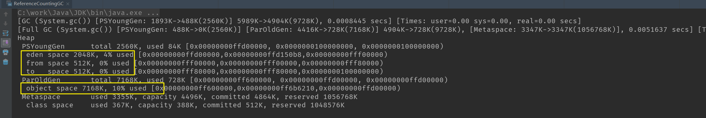
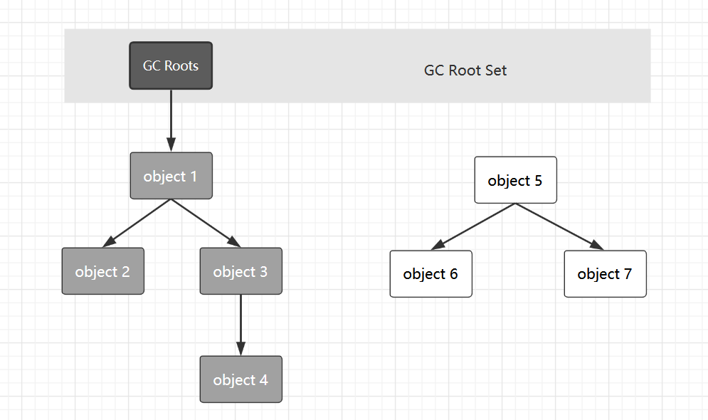

## 判断对象是否存活算法

#### 1 简述

堆里面存放着几乎所有的对象实例， 垃圾收集器对堆进行回收前需要确定哪些对象还存活，哪些已经死去（不可能被任何途径使用的对象）。

其实这个也好理解，你要回收垃圾，总得知道哪些是垃圾吧。

#### 2 引用计数算法（Reference Counting）

##### 2.1 算法思想

给对象添加一个引用计数器，每当有一个地方引用它时，计数器值就加1；

当引用失效，计数器值就减1；

任何时刻计数器为0的对象就是不可能再被使用的。

##### 2.2 存在问题

​	难以解决对象之间相互循环引用的问题，所以主流 Java 虚拟机里面没有选用技术算法来管理内存。

* 问题测试

  假设虚拟机采用的是引用计数算法，那么当两个对象相互引用而没有被其它对象引用的时候，即各自的引用计数值都不为 0 ，那么垃圾回收时候必然不会被回收，实例验证下：

  ```java
  package com.skylaker.jvm.gc;
  
  /**
   * 判断当前虚拟机是否采用的引用计数算法来判断垃圾
   *
   * @author skylaker
   * @version V1.0 2020/4/1 18:54
   */
  public class ReferenceCountingGC {
      // 设置一个临时的2M大小的数组，只为了占据内存
      private byte[] data = new byte[2 * 1024 * 1024];
  
      private ReferenceCountingGC instance;
  
      public static void main(String[] args) {
          ReferenceCountingGC objA = new ReferenceCountingGC();
          ReferenceCountingGC objB = new ReferenceCountingGC();
          objA.instance = objB;
          objB.instance = objA;
  
          objA = null;
          objB = null;
          System.gc();
      }
  }
  ```

  虚拟机参数：**-Xms10m -Xmx10m -XX:+PrintGCDetails**；

  其中我们利用 **-XX:+PrintGCDetails** 参数来打印发生垃圾回收时候的详细日志；

  

  我们创建的两个对象，每个对象占用2M的空间，从GC过后的空间占用情况看，这两个对象已经被回收掉。

  注意上面调用GC前设置两个引用为空：`objA = null;  objB = null;` 就是为了去除两个对象实例的外部引用，只剩它们之间相互引用，如果采用引用计数算法，它们的引用计数值都为1，不应该被回收，但是现在回收了，说明虚拟机不是采用这个算法。但是如果去掉上面这个设置引用为空，那么两个对象就不会被回收掉了，因为它们还存在外部引用 。

#### 3 可达性分析算法（Reachability Analysis）

##### 3.1 算法思想

通过一系列称为“GC Roots”的对象作为起始点，从这些节点开始向下搜索，搜索所走过的路径称为引用链（Reference Chain）,当一个对象到 GC Roots 没有任何引用链相连时，则证明这个对象是不可用的。

Java语言中, 可作为 GC Roots 的对象包括以下几种：

* 虚拟机栈（栈帧中的本地变量表）中引用的对象；
* 方法区中类静态属性引用的对象；
* 方法区中常量引用的对象；
* 本地方法栈中 JNI （即一般说的Native方法）引用的对象。

##### 3.2 理解

生活中一个东西成了垃圾，不就是因为没有被利用的价值了嘛（不谈垃圾再利用），那么同样的，我们谈堆中的对象成了垃圾，本质上也是因为没有再被利用的价值，一个系统 A ，堆中有10个对象，其中8个对象还在使用，剩下的2个一直用不到，那么这2个其实就是垃圾了。我们创建的对象在堆中，一个对象可能直接被某个虚拟栈中的引用引用，也可能被某个对象成员变量引用，只要这个对象被这个引用链关联到就是存活的。正如下图：



object1到object4 都是可以路由到 GC Roots 的，自然是存活的对象，而 object5 到 object7 虽然自身关联，但是不可达 GC Roots ，就是垃圾对象。

#### 4 引用分类

JDK1.2 之后，引用分为4种：强引用、软引用、弱引用、虚引用。

* **强引用（Strong Reference）**

  类似 `Object obj = new Object()` 这种栈中引用变量直接引用对象的形式。只要强引用还存在，垃圾收集器永远不会回收这些对象。

* **软引用（Soft Reference）**

  * 用来描述一些还有用但是并非必须的对象；

  * 利用 **SoftReference** 类来实现软引用；

  * 软引用关联的对象，在系统将要发生内存溢出异常之前，将会把这些对象列进回收范围中进行第二次回收。如果回收后还没足够内存，则抛出内存溢出异常；

    （相当于先回收垃圾对象，但是内存还不够就要OOM了，那就再牺牲下软引用对象，把软引用对象回收了，来释放更多内存，尽量避免 OOM）

* **弱引用（Weak Reference）**
  * 也是用来描述非必需的对象，但强度比软引用还要弱；
  * **WeakReference** 类来实现弱引用；
  * 弱引用关联的对象只能生存到下一次垃圾收集发生之前，当垃圾收集时，无论当前内存是否足够，都会回收掉只被弱引用关联的对象。

* **虚引用（Phantom Reference）**
  * 也称为幽灵引用或者幻影引用，是最弱的引用关系；
  * **PhantomReference** 类来实现虚引用；
  * 为对象设置虚引用的唯一目的就是能在这个对象被收集器回收时收到一个系统通知；

#### 5 回收方法区

方法区收集主要回收脸两部分内容：废弃常量、无用的类。

判定一个类是否是无用的类的条件，需要同时满足：

* 该类所以实例都已被回收，也就是堆中不存在该类的任何实例；
* 加载该类的 ClassLoader 已经被回收；
* 该类对应的 java.lang.Class 对象没有在任何地方被引用，无法在任何地方通过反射访问该类的方法。