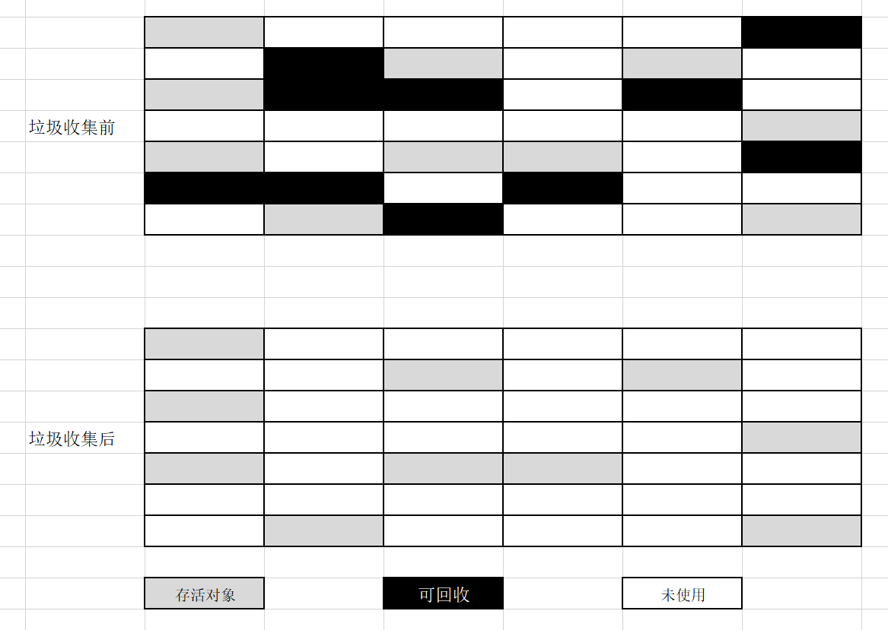
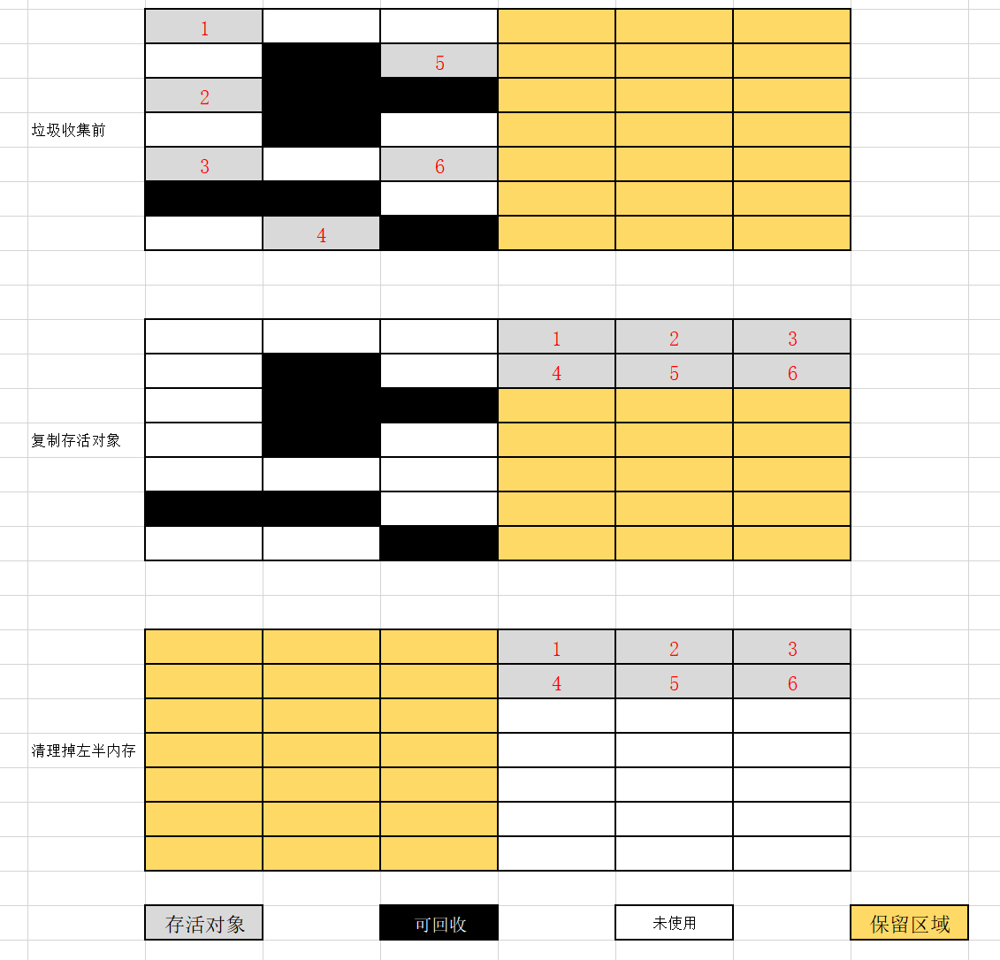
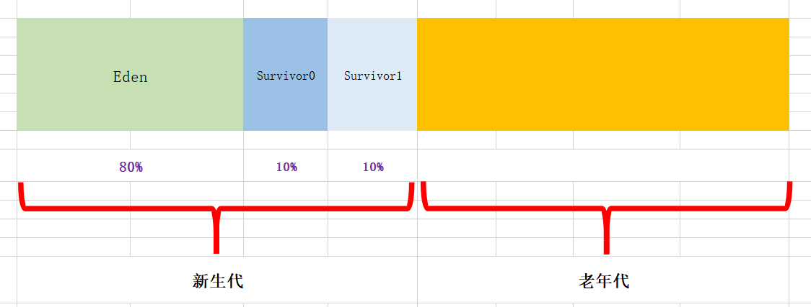
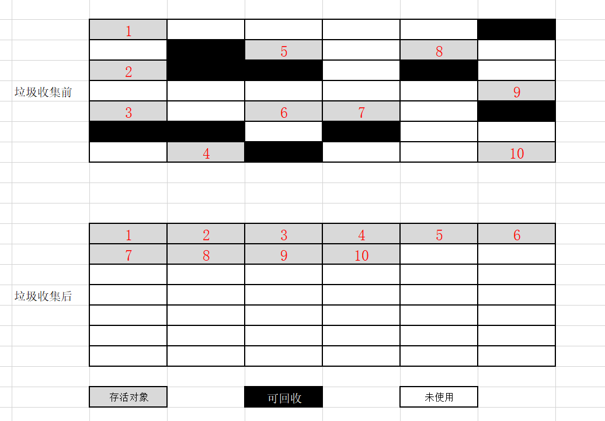

## 垃圾收集算法

#### 1 标记-清除算法（Mark-Sweep）

##### 1.1 算法思想

* 算法分为两个阶段：标记、清除；
* 首先标记出所有需要回收的对象，在标记完成后统一回收所有被标记的对象。

##### 1.2 图示

##### 1.3 存在问题

* 效率问题

  标记和清除两个过程效率都不高，因为有大量垃圾存在时，需要一个个标记和清除，假设空间 99% 都是垃圾，那么需要清除 99% 的空间，那么为啥不反过来直接保留存活的 1% 对象呢。

* 空间问题

  标记清除后会产生大量不连续的内存碎片，空间碎片多可能会导致以后程序运行时需要分配大对象时，无法找到足够连续内存导致提前触发另一次垃圾收集动作。

#### 2 复制算法（Copying）

##### 2.1 算法思想

将可用内存按容量分为大小相等的两块，每次只使用其中的一块。当这块内存使用完，就将还存活的对象复制到另一块上面，然后再把已使用过的内存空间一次清理掉。

##### 2.2 优缺点

每次只对半区进行内存回收，内存分配不用考虑空间碎片问题。

可用内存缩小为一半，浪费空间。

这个操作适用于存活对象比例少的情况，因为复制时候只需要复制少量的对象，不需要像标记清除算法面对大量垃圾对象长时间耗时回收。

如果存活对象较多也不适合，需要进行较多的复制操作，效率变低。

##### 2.3 图示

##### 2.4 新生代区域

HotSpot虚拟机**堆**内存的**新生代**划分为较大的 **Eden** 空间和两块较小的 **Survivor** 空间，每次使用 Eden 和其中一个 Survivor 。

当回收时，将Eden 和 Survivor 中还存活的对象一次性复制到另外一块 Survivor 空间上，最后清理掉 Eden 和 刚才使用过的 Survivor 空间。HotSpot 虚拟机默认 Eden 和 Survivor 的大小比例是 **8:1**，即每次新生代可用内存容量为 80% + 10% = 90%。

但是每次 Eden 和 一个 Survivor 存活的对象不可能都小于 10%，即可能一次存活的对象较多，另一个 Survivor 空间放不下，那么就需要通过分配担保机制直接进入老年代。

#### 3 标记-整理算法（Mark-Compact）

##### 3.1 算法思想

标记过程仍然和“标记-清除”算法一样，但后续步骤不是直接对可回收对象进行清理，而是让所有存活的对象都向一端移动，然后直接清理掉端边界以外的内存。

##### 3.2 图示

#### 4 分代收集算法

商业虚拟机采用“**分代收集**”（Generational Collection）算法，即根据对象存活周期的不同将内存划分为几块，一般把堆分为新生代和老年代，根据各个年代的特点采用最适当的收集算法。

* **新生代**中每次垃圾收集时都有大量对象死去，只有少量存活，并且有老年代可分配担保，适合**复制**算法；

* **老年代**对象存活率高，没有额外空间可分配担保，就要使用 **标记-清理** 或者 **标记-整理** 算法进行回收。

#### 5 HotSpot的算法实现

##### 5.1 枚举根节点

* 可达性分析效率影响在：
  * 检查引用

    可作为GC Roots的节点主要在**全局性的引用**（例如常量或类静态属性）与**执行上下文**（例如栈帧中的本地变量表）中；仅方法区就很大，逐个检查很耗时；

  * GC停顿

    可达性分析需要在确保一致性的快照中进行；

    **Stop The Word**：在整个分析期间整个执行系统暂停，不能出现分析过程中对象引用关系还在不断变化的情况，否则结果准确定无法保证；

    其实简单地理解就是，既然要垃圾回收，那么我回收地时候总不至于你还在不停地扔垃圾吧，我垃圾回收工作开始地时候，大家都停一停，先让我回收完，就是大概这么个过程。

* 快速 GC Roots 枚举

  虚拟机使用 **OopMap** 的数据结构来直接得知哪些地方存放着对象引用，而不需要一个不漏地检查完所有执行上下文和全局地引用位置；

  在类加载地时候，HotSpot就把对象内什么偏移量上是什么类型地数据计算出来，在 JIT 编译过程中，也会在特定地位置记录下栈和寄存器中哪些位置是引用。

##### 5.2 安全点

* 如果为每条指令都生成对应地 **OopMap**，那么就会需要大量地额外空间，这样 GC 成本将会变得很高；

* HotSpot 只会在 **安全点** （Safepoint） , 即程序执行时并非能在所有地方都能停顿下来开始 GC，只有到达安全点时才能暂停；

* 安全点选择的标准：是否具有让程序**长时间执行**的特征；所以具有”长时间执行“的指令，例如**方法调用、循环跳转、异常跳转**等指令才会产生 Safepoint 。

* 如何在 GC 发生时让所有线程都”跑“到最近的安全点上再暂停下来，两种方案：
  * **抢先式中断**（Preenmptive Suspension）：不需要线程执行代码主动配合，发生 GC 时候，首先把所有线程中断，发现有线程中断地方不在安全点，则恢复线程，让它”跑“到安全点。几乎没有虚拟机采用这种方案；
  * **主动式中断**（Voluntary Suspension）: GC 需要中断线程时候，不直接对线程操作，仅仅简单**设置一个标志**，各个线程执行时**主动去轮询**这个标志，发现中断标识为**真**时就自己**中断挂起**。

##### 5.3 安全区域

* 对于”不执行“即没有 CPU 时间，例如处于Sleep或Blocked状态的程序，无法响应JVM中断请求，走到安全点中断挂起，需要用”安全区域（Safe Region）“ 来解决；

* **安全区域（Safe Region）**：一段代码中，引用关系不会发生变化，在这个区域中任意地方开始GC都是安全的。线程执行到 Safe Region 中代码时，首先意识到自己已进入 Safe Region，当在在这段时间 HJVM 要发起 GC 时，就不用管标识自己为 Safe Region 状态的线程了，在线程要离开 Safe Region 时候，它要检查系统是否已经完成了根节点枚举（或整个 GC 过程），如果完成，那线程就继续运行，否则就需要等到到可以安全离开 Safe Region 的信号为止。