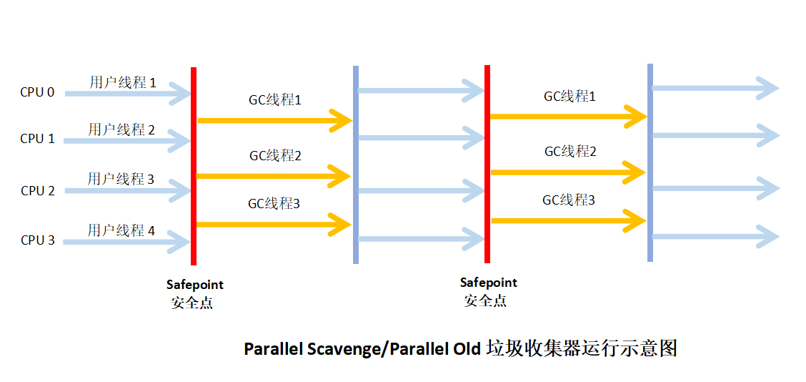
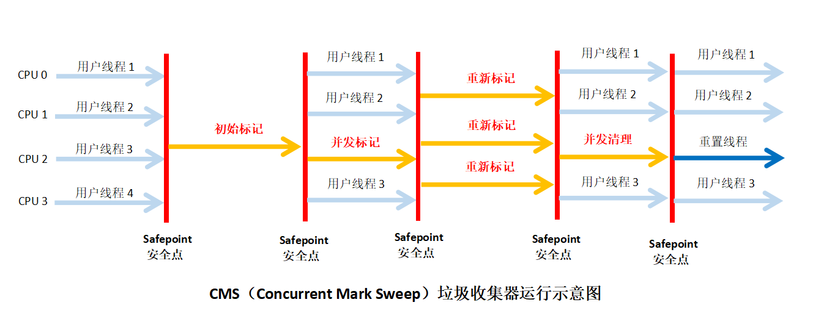
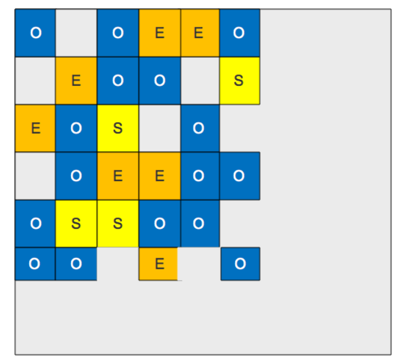
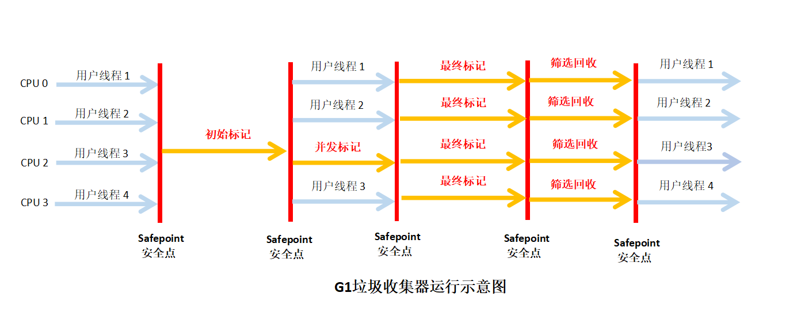

## 垃圾收集器

#### 1 概述

* 收集算法时内存回收的方法论，垃圾收集器就是内存回收具体实现；

* 不同厂商、不同版本虚拟机提供的垃圾收集器可能会很大差异；

* 没有最好的垃圾收集器，只有适用于特定场景的最合适的收集器；

* JDK 1.7 Update 14 之后 HotSpot 虚拟机中的垃圾收集器（JDK8之后其实还有新变化）（不同连线代表可以搭配使用）

  

#### 2 Serial 收集器

* 单线程收集器；

* 垃圾收集时候必须暂停其它所有的工作线程，直到收集结束；线程停顿会影响程序响应，用户体验下降；

* 虚拟机运行在 Client 模式下的默认新生代收集器；

* 优点：简单而高效（与其它收集器单线程比），限定但个CPU环境来说，没有线程交互开销更高效；

* 收集器运行示意图

  

#### 3 Serial Old 收集器

- Serial Old 是 Serial 收集器的老年代版本；

- 单线程收集器；
- 采用 ”标记—整理“ 算法；
- 主要意义：
  - 在于给 Client 模式下的虚拟机使用；
  - 在Server模式下，主要两大用途：
    - 一是 JDK 1.5 及以前版本中与 Parallel Scavenge 收集器搭配使用；
    - 二是作为CMS收集器的后备预案，在并发收集发生 Concurrent Mode Failure 时使用；

- 运行示意图：

  

#### 4 ParNew 收集器

* 可以当作 Serial 的**多线程**版本；

* 除使用多条线程进行垃圾收集外，其余行为包括 Serial 控制参数、收集算法、Stop The World等都与 Serial 收集器完全一样；

* 许多运行在 Server 模式下虚拟机中首选的新生代收集器；

* ParNew 收集器是选用 -XX:+UseConcMarkSweepGc 选项后的默认新生代收集器；

* 可以通过 -XX:+UseParNewGC 选项强制指定ParNew 收集器；

* 默认开启的收集器线程数量与CPU的数量相同；

* 可采用 -XX:ParallelGCThreads 参数来限制垃圾收集器的线程数量；

* 收集器运行示意图：

  

#### 5 Parallel Scavenge 收集器

* **新生代**收集器，采用**复制**算法，并行的**多线程**收集器；

* 目标：达到一个可控制的吞吐量（Throughput）；经常被称为 ”吞吐量优先“ 收集器；

  ```
  吞吐量 
  = CPU运行用户代码时间 / （CPU运行用户代码时间 + 垃圾收集时间）
  = CPU运行用户代码时间 / CPU总耗时时间
  ```

  例如 虚拟机总共运行了 100 分钟，其中用户线程运行 99 分钟，垃圾收集线程 1 分钟，那吞吐量就是 99%；

* 停顿时间越短越适合需要与用户交互的程序，快速响应速度能提升用户体验；

  高吞吐量则可以高效率利用 CPU 时间，适合后台运算而不需要太多交互的任务；

* 精确控制吞吐量参数：

  * **控制最大垃圾收集停顿时间**： -XX:MaxGCPauseMillis 参数；

    允许的设值是一个大于0的毫秒数，收集器将尽量保证内存回收花费的时间不超过设定值；

  * **设置吞吐量大小**： -XX:GCTimeRatio 参数

    GCTimeRatio 参数的值应当是一个大于0且小于100的整数，即垃圾收集时间占总时间的比率，等于吞吐量的倒数；

* GC 自适应的调节策略（GC Ergonomics）

  -XX:+UseAdaptiveSizePolicy ，该参数打开后，就不需要手工指定新生代的大小、Eden与Survivor区的比例、晋升老年代的对象年龄等细节参数，虚拟机会根据当前系统的运行情况收集性能监控信息，动态调整这些参数以提供最合适的停顿时间或者最大的吞吐量。

#### 6 Parallel Old 收集器

* Parallel Old 是 Parallel Scavenge 收集器的老年代版本；

* 使用**多线程** 和 “**标记-整理**”算法；

* 在注重吞吐量以及 CPU 资源敏感的场合，都可以优先考虑 Parallel Scavenge 加 Parallel Old 收集器；

* 运行示意图：

  

#### 7 CMS 收集器

* CMS （Concurrent Mark Sweep）是以获取**最短回收停顿时间**为目标的收集器，直白点就是垃圾收集快；

* 适用场景：互联网站或者 B/S系统的服务器，响应速度快；

* 基于 “**标记-清除**” 算法；

* 运行过程分为4个步骤：

  * **初始标记**（CMS initial mark）:

    标记以下 GC Roots 能直接关联到的对象 ，速度很快；需要 Stop The World ;

  * **并发标记**（CMS concurrent mark）

    进行 GC Roots Tracing 的过程；

    并发标记线程可以和用户线程一起工作；

  * **重新标记**（CMS remark）

    修正并发标记期间因用户程序继续运作而导致标记产生变动的那一部分对象的标记记录；

    需要 Stop The World ;

  * **并发清除**（CMS concurrent sweep）

    并发清除线程可以和用户线程一起工作；

* 运行示意图：

  

* 优点：**并发收集**、**低停顿**；

* 缺点：

  * CMS 收集器对 CPU 资源非常敏感；并发阶段因为占用一部分线程而导致应用程序变慢，总吞吐量降低；

  * 垃圾收集阶段用户线程还需要运行

    * CMS 无法处理浮动垃圾，并发清理阶段用户线程还在运行，这期间产生的垃圾出现在标记过程之后，CMS无法当次收集；可能出现 ”Concurrent Mode Failure“ 失败导致另一次 Full GC 的产生；

    * CMS收集器不能像其它收集器那样等到老年代几乎被填满再收集，需要预留一部分空间提供并发收集程序使用；
    * JDK1.6 中老年代使用 92% ，激活CMS垃圾收集，可通过 -XX:CMSInitiatingOccupancyFraction 来提高百分比；但是这个值不宜设置过大，否则预留空间不足容易引发 ”Concurrent Mode Failure“；

    * CMS运行期间预留的内容无法满足程序需求，会出现一次 ”Concurrent Mode Failure“ ，虚拟机会启动后备预案，临时启用 Serial Old 收集器来重新进行老年代回收，这样会导致停顿时间更长；

  * 基于 标记—清除 算法

    * 会产生大量空间碎片；

    *  -XX:+UseCMSCompactrAtFullCollection 开关参数在 CMS 收集器顶不住要进行 FullGC 时候开启内存碎片合并整理；

    * -XX:CMSFullGCsBeforeCompaction 用来设置执行多少次不带压缩的 Full GC 后，跟着来一次带压缩的GC （默认0，即每次进入 Full GC 都进行碎片整理）；

#### 8  G1 收集器

* 面向服务端应用的垃圾收集器；
* 特点：
  * 并行与并发：利用多 CPU 缩短 Stop-The-World 的停顿时间；
  * 分代收集：可独立管理 GC 堆；
  * 空间整合：运作期间不会产生内存碎片；
  * 可预测的停顿：能建立可预测的停顿时间模型，能让使用者明确指定在一个长度为 M 毫秒的时间片段内，消耗在垃圾收集上的时间不得超过N毫秒。

* **使用 Region 划分内存空间**

  G1 将整个 Java 堆划分为多个大小相等的独立区域（Region），虽然还保留新生代和老年代的概念，但新生代和老年代不在是物理隔离的，都是一部分 Region （不需要连续）的集合；

  例如图示（O表示老生代（Old），E表示Eden，S表示Survivor）：

  

* **有优先级的区域回收**

  G1 跟踪各个 Region 里面垃圾堆积的价值大小（回收所获得空间大小以及回收所需时间的经验值），后台维护一个优点列表，每次根据允许收集时间，有限回收价值最大的 Region ；

* 运作过程：

  * **初始标记**（Initial Marking）

    仅仅只是标记一下 GC Roots 能直接关联到的对象，并且修改 TAMS （Next Top at Mark Start）的值；

    需要停顿线程，但耗时很短；

  * **并发标记**（Concurrent Marking）

    从 GC Roots 开始对堆中对象进行可达性分析，找出存活对象；

    此阶段耗时较长，但是可与用户线程并发执行；

  * **最终标记**（Final Marking）

    修正并发标记阶段因用户程序运行导致标记产生变动的那一部分标记记录；

    需要停顿线程，但可多线程并行执行标记；

  * **筛选回收**（Live Data Counting and Evacuation）

    对各个Region的回收价值和成本进行排序，根据用户所期望的 GC 停顿时间来制定回收计划；

* 运行示意图

  