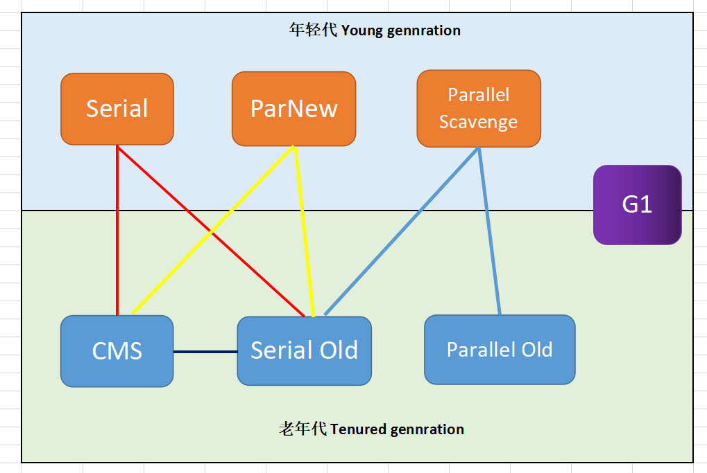
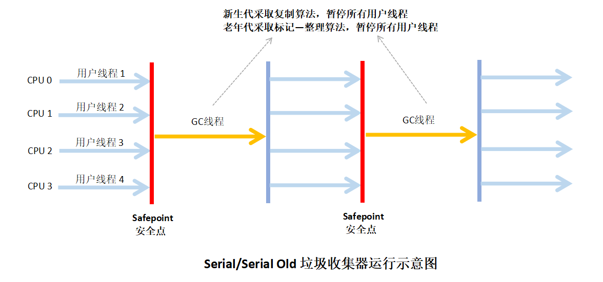
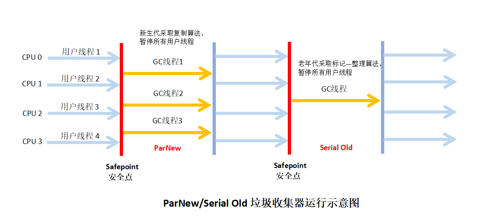

## 垃圾收集器

#### 1 概述

* 收集算法时内存回收的方法论，垃圾收集器就是内存回收具体实现；

* 不同厂商、不同版本虚拟机提供的垃圾收集器可能会很大差异；

* 没有最好的垃圾收集器，只有适用于特定场景的最合适的收集器；

* JDK 1.7 Update 14 之后 HotSpot 虚拟机中的垃圾收集器（JDK8之后其实还有新变化）（不同连线代表可以搭配使用）

  

#### 2 Serial 收集器

* 单线程收集器；

* 垃圾收集时候必须暂停其它所有的工作线程，直到收集结束；线程停顿会影响程序响应，用户体验下降；

* 虚拟机运行在 Client 模式下的默认新生代收集器；

* 优点：简单而高效（与其它收集器单线程比），限定但个CPU环境来说，没有线程交互开销更高效；

* 收集器运行示意图

  

#### 3 Serial Old 收集器

- Serial Old 是 Serial 收集器的老年代版本；

- 单线程收集器；
- 采用 ”标记—整理“ 算法；
- 主要意义：
  - 在于给 Client 模式下的虚拟机使用；
  - 在Server模式下，主要两大用途：
    - 一是 JDK 1.5 及以前版本中与 Parallel Scavenge 收集器搭配使用；
    - 二是作为CMS收集器的后备预案，在并发收集发生 Concurrent Mode Failure 时使用；

- 运行示意图：

  

#### 4 ParNew 收集器

* 可以当作 Serial 的**多线程**版本；

* 除使用多条线程进行垃圾收集外，其余行为包括 Serial 控制参数、收集算法、Stop The World等都与 Serial 收集器完全一样；

* 许多运行在 Server 模式下虚拟机中首选的新生代收集器；

* ParNew 收集器是选用 -XX:+UseConcMarkSweepGc 选项后的默认新生代收集器；

* 可以通过 -XX:+UseParNewGC 选项强制指定ParNew 收集器；

* 默认开启的收集器线程数量与CPU的数量相同；

* 可采用 -XX:ParallelGCThreads 参数来限制垃圾收集器的线程数量；

* 收集器运行示意图：

  

#### 5 Parallel Scavenge 收集器

* **新生代**收集器，采用**复制**算法，并行的**多线程**收集器；

* 目标：达到一个可控制的吞吐量（Throughput）；经常被称为 ”吞吐量优先“ 收集器；

  ```
  吞吐量 
  = CPU运行用户代码时间 / （CPU运行用户代码时间 + 垃圾收集时间）
  = CPU运行用户代码时间 / CPU总耗时时间
  ```

  例如 虚拟机总共运行了 100 分钟，其中用户线程运行 99 分钟，垃圾收集线程 1 分钟，那吞吐量就是 99%；

* 停顿时间越短越适合需要与用户交互的程序，快速响应速度能提升用户体验；

  高吞吐量则可以高效率利用 CPU 时间，适合后台运算而不需要太多交互的任务；

* 精确控制吞吐量参数：

  * **控制最大垃圾收集停顿时间**： -XX:MaxGCPauseMillis 参数；

    允许的设值是一个大于0的毫秒数，收集器将尽量保证内存回收花费的时间不超过设定值；

  * **设置吞吐量大小**： -XX:GCTimeRatio 参数

    GCTimeRatio 参数的值应当是一个大于0且小于100的整数，即垃圾收集时间占总时间的比率，等于吞吐量的倒数；

* GC 自适应的调节策略（GC Ergonomics）

  -XX:+UseAdaptiveSizePolicy ，该参数打开后，就不需要手工指定新生代的大小、Eden与Survivor区的比例、晋升老年代的对象年龄等细节参数，虚拟机会根据当前系统的运行情况收集性能监控信息，动态调整这些参数以提供最合适的停顿时间或者最大的吞吐量。

#### 6 Parallel Old 收集器

