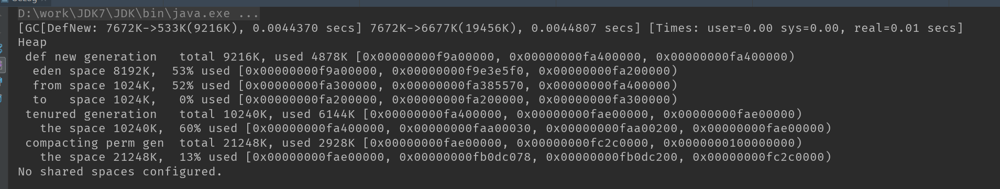
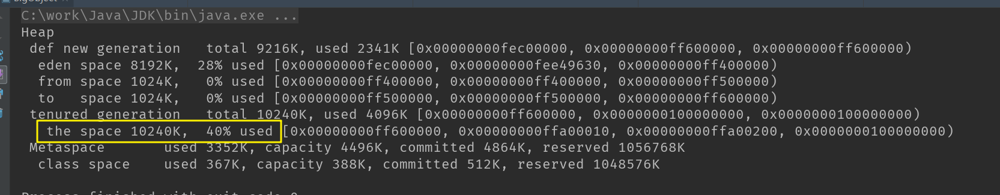
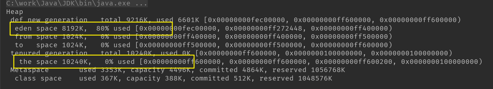
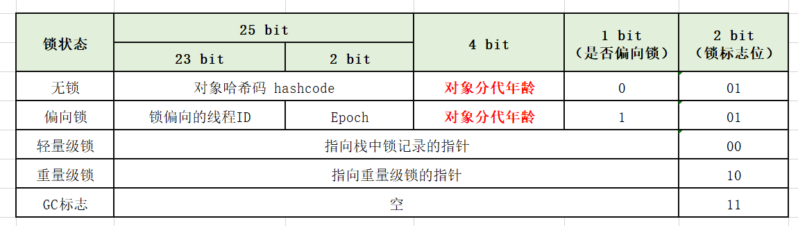
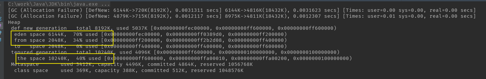
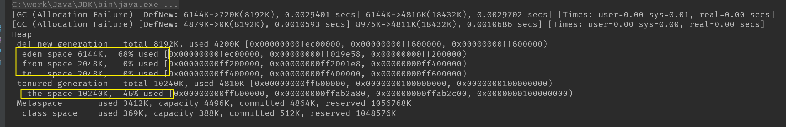
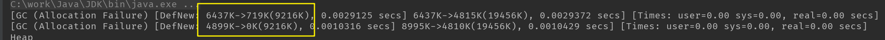
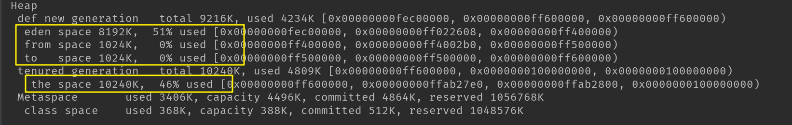
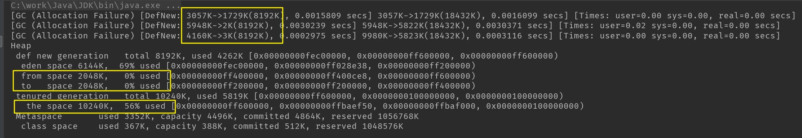

### 内存分配与回收策略

#### 1 概述

自动内存管理核心两件事：

* **给对象分配内存**

  对象主要在堆上分配，主要分配在新生代的 Eden 区域，如果启用本地分配缓冲，将按线程优先在TLAB上分配，少数情况下也可能直接分配在老年代中。具体分配规则细节取决于使用哪一种垃圾收集器组合，还有虚拟机中与内存相关的参数设置；

* **回收分配给对象的内存**

  即垃圾收集器体系相关内容，包括垃圾标记算法、垃圾回收算法、垃圾收集器等；

#### 2 对象优先在 Eden 区分配

* 大多数情况，对象在新生代 **Eden** 区分配； Eden **没有足够空间**进行分配时，虚拟机将发起一次 **Minor GC** ;

* **-XX:+PrintGCDetails** 垃圾收集器日志参数，虚拟机发生GC时候打印内存回收日志，并且在退出的时候输出当前的内存各区域分配情况；

* 测试

  * 代码

  ```java
  public class GCLog {
      private static final int SIZE_1MB = 1024 * 1024;
  
      public static void main(String[] args) {
          byte[] a, b, c, d;
  
          a = new byte[2 * SIZE_1MB];
          b = new byte[2 * SIZE_1MB];
          c = new byte[2 * SIZE_1MB];
          d = new byte[4 * SIZE_1MB];
      }
  }
  ```

  * JDK版本：1.7.0_80

  * 虚拟机参数

    **-Xms20m -Xmx20m -Xmn10m -XX:+PrintGCDetails -XX:+UseSerialGC -XX:SurvivorRatio=8**

    即 整个堆20M，新生代10M，新生代按照 8:1:1的比例进行分配，则 Eden 区域 8M ，S0 和 S1 区各 1M，老年代 10M，同时设置 -XX:+UseSerialGC采用 Serial + Serial Old 的收集器组合

  * 运行结果：

    

  ​	    可以看到打印的 GC 日志以及退出虚拟机时候输出的各内存情况。

  ​	    代码中新生成三个 2M 大小对象数组，再分配第四个对象时候，因为 Eden 已经占用 6M 大小，空间不	 		够，	引发一次 Minor GC ，新生代空间 从 7672K 回收后 533K（这个7672K 比 6M大因为毕竟程序运		行还有其它	资源需要占用空间），但是整体堆容量大小几乎没变，从 7672K 到 6677K，因为 a、b、		c 在垃圾回收的时	候发现是存活对象，但是又无法放入大小为 1M 的 Survivor 空间，所以通过分配担		保机制提前转移到老年	代。4M 大小的对象也顺利放到 Eden 空间，所以整个程序运行结束打印的内		存空间情况 Eden 区域 53% 近 	4M 空间被占用，老年代 60% 即 6M 空间大小被占用。

#### 3 大对象直接进入老年代

* 大对象：需要**大量连续空间**的 Java 对象；典型大对象：很长的字符串、数组；

  经常出现大对象容易导致内存还有不少空间就提前触发 GC （因为可能存在空间碎片，剩余的空间总量够，但是没有足够的连续空间）；

* **-XX:PretenureSizeThreshold** 参数

  * 大于这个设置值得对象直接在老年代分配

  * 目标是避免在 Eden 和两个 Survivor 区发生大量的内存复制；

  * 该参数只对 Serial 和 ParNew 两款收集器有效；

  * 该参数值不能设置 M字节大小，需要直接设置字节大小，例如设置超过 3M 大小的对象直接进入老年代：-XX:PretenureSizeThreshold=3145728

* 测试

  * 代码

    ```java
    public class BigObject {
        public static void main(String[] args) {
            byte[] a = new byte[4 * 1024 * 1024];
        }
    }
    ```

  * JDK版本：1.8.0_161

  * 虚拟机参数

    ```java
    -Xms20m -Xmx20m -Xmn10m -XX:+PrintGCDetails -XX:+UseSerialGC -XX:SurvivorRatio=8 
    -XX:PretenureSizeThreshold=3145728
    ```

    设置超过 3M 大小的对象直接进入老年代

  * 执行结果

    

    老年代占用 40% 即 4M 大小空间，而 Eden 区虽然有 8M ，但是也只占用了很小一部分（程序运行资源需要占用），即创建的大对象直接进入了老年代。

    我们可以去掉 -XX:PretenureSizeThreshold=3145728 参数看看：

    

    Eden 区域占用 80% ，老年代 0% 没有占用，说明对象还是默认放到了 Eden 区域。

#### 4 长期存活对象将进入老年代

* 对象年龄

  * 虚拟机给每个对象定义了一个**对象年龄**（Age）**计数器**；该值保存在对象头Markword中，例如 32 HotSpot虚拟机：

    

  * 如果对象在 **Eden** 出生并经过第一次 **Minor GC** 后仍然存活，并能被 Survivor 容纳的话，将被移动到 Survivor 空间中，并且**对象年龄设为 1**，对象在 Survivor 每“熬过”一次 Minor GC , 年龄就**增加一岁**，当年龄增加到一定程度（默认**15岁**），将**晋升到老年代**。
  * 对象晋升老年代的年龄阈值，可通过参数 **-XX:MaxTenuringThreshold** 设置。

* 测试

  * 代码

    ```java
    public class ObjectAge {
        private static final int SIZE_1MB = 1024 * 1024;
    
        public static void main(String[] args) {
            byte[] a, b, c, d;
    
            a = new byte[10 * 1024];    // 10K
            b = new byte[4 * SIZE_1MB];
            c = new byte[4 * SIZE_1MB]; // 发生GC
            c = null;
            d = new byte[4 * SIZE_1MB]; // 发生 GC
        }
    }
    ```

  * JDK 1.8.0_161

  * 虚拟机参数

    * 对象晋升年龄**阈值 15**

    ```
    -Xms20m -Xmx20m -Xmn10m -XX:+PrintGCDetails -XX:+UseSerialGC -XX:SurvivorRatio=3 
    -XX:MaxTenuringThreshold=15
    ```

    ​	这里设置 Eden 大小 6M, S0 和 S1 大小 2M，设置对象年龄阈值15
    ​	*  运行结果

    

    ​	可以看到第一次发生 Minor GC ，a对象进入Survivor，年龄为 1 ；b 对象太大直接进入老年代；

    ​	第二次GC，C 对象被垃圾回收，d对象在 Eden 区，而 a 对象因为年龄变成 2 ，但是还不满足晋升年龄	阈值所以还是在 Survivor 区域，所以最终显示的 from space 空间 34% 被占用

    * 对象晋升年龄**阈值 1**

    ```
    -Xms20m -Xmx20m -Xmn10m -XX:+PrintGCDetails -XX:+UseSerialGC -XX:SurvivorRatio=3 
    -XX:MaxTenuringThreshold=1
    ```

    ​	

    可以看到 Survivor 区域为空，而老年代大小提升了 6% 

* 注意问题

  这里测试的时候需要注意一个问题，就是程序本身运行所需要其他隐性资源，也会占用一定的空间。例如默认情况下或者晋升年龄阈值15，我们设置 Eden 8M， S0、S1空间1M，对象设置 0.3M ，但是怎么测试对象就是不在 S0 或者 S1区域，感觉对象年龄才1啊，对象应该在 S0 或者 S1 区域啊，很奇怪。其实可以查看GC日志信息，例如：

  

  发生了两次 GC ，第一次 GC 后新生代剩余 719K，第二次直接剩余 0K了，看下内存情况

  

  这个程序运行处理过程中可能涉及下面说的动态对象年龄判断，可能我们设置的对象和系统资源对象占用的 S0 或者 S1 大小已经占 S0或 S1一半大小了，那么会直接进入老年代，不用等到晋升年龄阈值。所以测试时候我们可以将 S0、S1设置大点，目标对象设置小点，这样就避免占用超过 S0或 S1 一半以上内存导致因为动态对象年龄问题造成对象不在 Survivor区域，影响结果判断。

#### 4 动态对象年龄判定

* 概述
  * 为适应不同程序内存状况，虚拟机并不是总要求对象年龄必须达到 MaxTenuringThreshold 才能晋升老年代；
  * 如果 Survivor 空间中**相同年龄**所有对象大小的**总和大于** Survivor 空间的**一半**，年龄**大于或等于**该年龄的对象就可**直接进入老年代**，无需等到 MaxTenuringThreshold 中要求的年龄；

* 测试

  * 代码

    ```java
    private static final int SIZE_1MB = 1024 * 1024;
    
    public static void main(String[] args) {
            byte[] a, b, c, d, e;
    
            a = new byte[512 * 1024];    // 0.5M
            e = new byte[512 * 1024];    // 0.5M
            b = new byte[4 * SIZE_1MB];
            c = new byte[4 * SIZE_1MB];
            c = null;
            d = new byte[4 * SIZE_1MB];
    }
    ```

  - JDK 1.8.0_161

  - 虚拟机参数

    - 对象晋升年龄**阈值 15**

    ```
    -Xms20m -Xmx20m -Xmn10m -XX:+PrintGCDetails -XX:+UseSerialGC -XX:SurvivorRatio=3 
    -XX:MaxTenuringThreshold=15
    ```

    ​	这里设置 Eden 大小 6M, S0 和 S1 大小 2M，设置对象年龄阈值15

  * 执行结果

    

    可以看到第一次 Minor GC 垃圾回收后新生代占用1729K，a 和 e 对象还在新生代，后两次 Minor GC 直接新生代主要回收新生代中 b、c 对象（b进入老年代，c 被当成垃圾回收），而 a、e 因为整体总和大小达到 S0 或 S1 的一半，所以直接晋升到老年代，可以看到老年代占用 56%，其中除了 b 对象 占用 40% 外，a 和 e 大约 10% （还有些系统资源对象）。

#### 5 空间分配担保

##### 5.1 概述

* 在发生 Minor GC 之前，虚拟机检查老年代**最大可用的连续空间**是否**大于**新生代所有对象**总空间**；
  * 如果这个条件成立，那么 Minor GC 可以确保是安全的；
  * 如果不成立，则虚拟机会查看 **HandlePromotionFailure** 设置值是否允许担保失败：
    * 如果允许，那么会继续检查**老年代最大可用连续空间**是否**大于**历次**晋升**到老年代对象的**平均大小**，如果大于，将尝试一次 Minor GC，尽管这次 Minor GC 是有风险的；
    * 如果小于，或 HandlePromotionFailure 设置不允许冒险，那这时也要改为进行一次 Full GC 。 

* JDK 6 Update 24 之后，HandlePromotionFailure 参数不会再影响到虚拟机的空间分配担保策略，规则变为：**只要老年代的连续空间大于新生代对象总大小或者历次晋升的对象平均大小就会进行 Minor GC , 否则进行 Full GC** 。

* 简单理解，新生代垃圾收集后 Survivor 空间无法存放的存活对象需要放入老年代，但是既然要放，老年代总的有可用空间吧，如果老年代可用剩余空间足够大，比新生代总空间还大，那肯定无论新生代有多少存活对象进入老年代都能容纳；但是老年代可用空间小于新生代总大小呢？但是你想啊，一般新生代垃圾收集后全部对象存活进入老年代的概率很小吧，一般就一部分达到年龄或者大对象进入老年代，那么这个时候即使老年代可用空间不是那么大，但是还是有可能满足你这次新生代GC后存活对象进入老年代需求的，那也不能直接允许你直接进行 Minor GC 操作吧，假设真的不够呢？所以参考历史经验，看之前每次晋升到老年代的对象大小平均值，可用空间大于就允许 Minor GC , 这样大概率来说你晋升的对象我可以容纳；但是如果可用空间比历次晋升平均值还小，那就风险很大，只有先进行 Full GC 来释放老年代空间以保证此次空间分配担保成功。