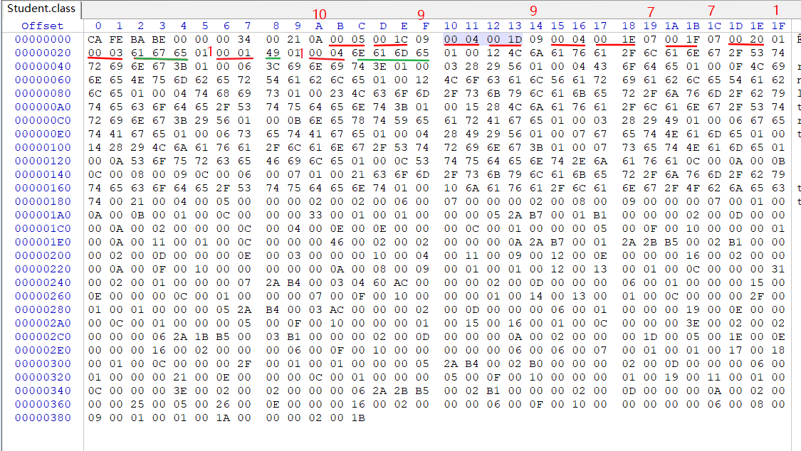

### 类文件结构

#### 1 无关性的基石

* 构成平台无关性的基石：各种不同平台的虚拟机与所有平台都统一使用的程序存储格式——**字节码**（ByteCode）

* Java 虚拟机也可以运行非 Java 语言，做到语言无关性；Java虚拟机不和包括 Java 在内的任何语言绑定，只与 “Class文件” 这种特定的二进制文件格式所关联； 

* Class 文件中包含了 Java 虚拟机指令集和符号表以及若干其他辅助信息；

* 不同语言可以经过编译成 Class 文件：

  

* Java 语言中的各种变量、关键字和运算符号的语义最终都是由多条字节码命令组合而成的，因此字节码命令所能提供的语言描述能力肯定比 Java 语言本身更加强大 。

#### 2 Class 类文件的结构

##### 2.1 基本组成及说明

* 任何一个 Class 文件都对应着唯一一个类或接口的定义信息，但是反过来说，类或接口并不一定都得定义在文件里即不一定以磁盘文件形式存在（例如可以通过类加载器直接生成等）；

* Class 文件是一组以8位字节为基础单位的二进制流，各个数据项目严格按照顺序紧凑地排列在 Class 文件中，中间没有添加任何分隔符；

* 遇到需要占用 8 位字节以上空间的数据项时候，会按照高位在前的方式分割成若干个8位字节进行存储；

* Java虚拟机规范：Class文件格式采用一种类似 C 语言结构体的伪结构来存储数据，这种伪结构只有两种数据类型：**无符号数**和**表**；

  * **无符号数**

    基本数据类型，以 u1、u2、u4、u8 来分别代表 1个字节、2个字节、4个字节和 8个字节的无符号数；

    无符号数可以用来描述数字、索引引用、数量值或者按照UTF-8 编码构成字符串值；

  * **表**

    表是由多个**无符号数**或者其他**表**作为数据项构成的**复**合数据类型，所有表都习惯性地 以“**_info**”结尾。

    表用于描述有**层次关系**的复合结构的数据，整个**Class文件本质上就是一张表**，它由如下数据项构成：

    

    按照上述表格描述，class 文件开头是 4字节的魔数、接下来是2字节+2字节的主次版本号，接下来是常量池……

* Class 字节码文件中的数据项，无论是顺序还是数量，甚至于数据存储的字节 序，都是被**严格限定**的，哪个 

  字节代表什么含义，长度是多少，先后顺序如何，都**不允许改变**。

##### 2.2 测试代码

开始详细学习 Class 字节码文件内容之前，先写一个测试代码编译成 Class 文件，再用 16进制编辑器查看内容，方便后续实时辅助学习：

```java
package com.skylaker.jvm.bytecode;

/**
 * @author skylaker
 * @version V1.0 2020/4/13 20:30
 */
public class Student {
    private int age;

    private String name;

    public Student(){

    }

    public Student(String name){
        this.name = name;
    }

    public int nextYearAge(){
        return this.age + 1;
    }

    public int getAge() {
        return age;
    }

    public void setAge(int age) {
        this.age = age;
    }

    public String getName() {
        return name;
    }

    public void setName(String name) {
        this.name = name;
    }
}

```

使用 WinHex 查看编译后的 class 文件：


##### 2.3 魔数与Class文件版本

* **魔数**

  * 每个Class文件的头4个字节称为**魔数（Magic Number）**：0xCAFEBABE（咖啡宝贝）

  * 它的唯一作用是确定这个文件是否为一个能被虚拟机接受的Class文件。直白点就是标识身份的作用；

  

* **Class文件的版本号**

  * 魔数后面的4个字节存储的是Class文件的版本号：

    第5和第6个字节是**次版本号**（Minor Version）；

    第7和第8个字节是**主版本号**（Major Version）；

  * Java版本号是从45开始 ，JDK 1.1之后的每个JDK大版本发布主版本号向上加1（JDK 1.0～1.1使用了45.0～45.3的版本号）；

  * 示例中 0x00000034，对应十进制 52， 即 对应 JDK8

    

##### 2.4 常量池

* 主次版本号之后的是常量池入口，常量池可以理解为Class文件之中的**资源仓库**； 

* **表**类型数据项目；

* 由于常量池中常量的数量是不固定的，所以在常量池的入口需要放置一项**u2**类型的数 

  据，代表**常量池容量计数值**（constant_pool_count）；容量计数是从1而不是0开始的，

  

  示例中0x0021 , 即十进制 33，代表常量池有32项常量，索引范围 1~32 .

* 常量池存储：主要存放两大类常量：**字面量**（Literal）和**符号引用**（Symbolic References）。 

  * **字面量**比较接近于Java语言层面的常量概念，如文本字符串、声明为final的常量值等。

  * **符号引用**则属于编译原理方面的概念，包括了下面三类常量： 
    * 类和接口的全限定名（Fully Qualified Name） 

    * 字段的名称和描述符（Descriptor） 

    * 方法的名称和描述符；

    Java代码在进行Javac编译的时候，并不像C和C++那样有“连接”这一步骤，在**虚拟机加载Class文件的时候进行动态连接**。也就是说，在Class文件中不会保存各个方法、字段的最终内存布局信息，因此这些字段、方法的符号引用不经过运行期转换的话无法得到真正 的内存入口地址，也就无法直接被虚拟机使用。当**虚拟机运行**时，需要从常量池获得对应的符号引用，再在**类创建时或运行时解析、翻译到具体的内存地址之中**。

    直白点理解就是class文件定义的只是静态的模板信息，具体像对象内存地址这些肯定要程序实际运行的时候才能确定，现在编译的时候肯定不知道，那就先做个标记，后期虚拟机实际运行时候再转换成真正的地址信息等。

* 常量池中每一项常量都是一个表；共有14种常量类型（截止 JDK1.7），这14种表共同的特点：**表开始的第一位是一个u1类型的标志位**（tag，取值见下表标志列），代表当前这个常量属于哪种**常量类型**：

  

  * 这14种常量类型各自均有自己的结构；

  * 其实常量池每一项占据的字节宽度是“固定”的，我们可以通过常量池结构总表来推算出每一项占据的字节数量。

    

    

  

  ​	好比如张三占3个坑，李四占5个坑，那么我们可以从前到后数坑数，第一个发现5个坑，那就是李四……

  ​	

  ​	对于上面的例子我们可以依次推算出每一个常量项，例如第一个 0A 对应第10个 CONATANT_Methodred_info类型，后面是紧跟着方法签名和返回类型索引，分别指向 0x0005 和 0x001c 即第5个和第28个常量项 ，后面的依次类推……

  

  我们可以直接通过 javap -verbose 命令查看字节码内容，可以看下常量池的字节码转义内容：

  

  

项目之一，同时它还是在Class文件中第一个出现的表类型数据项目