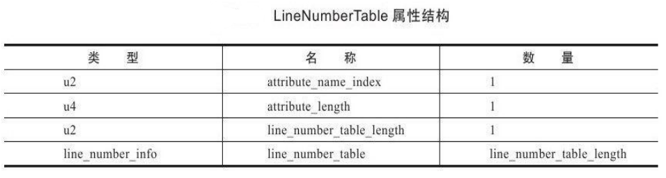
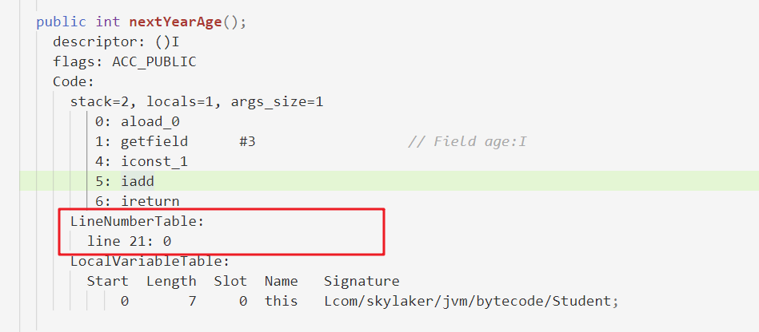
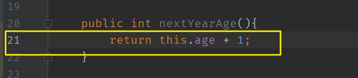
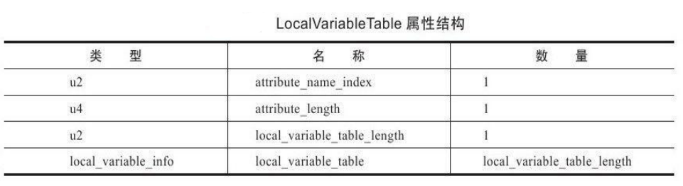
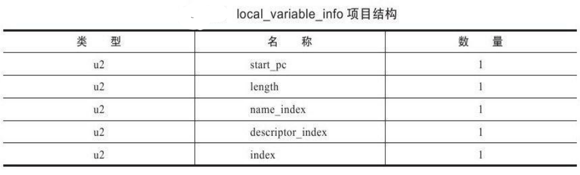
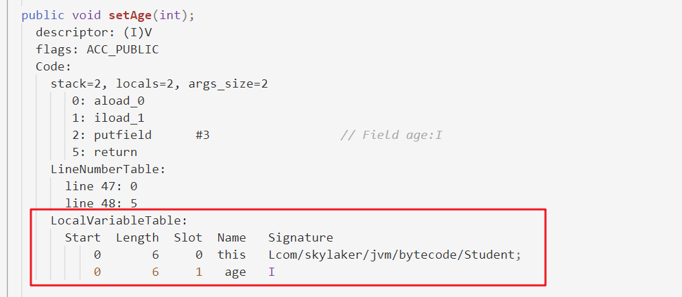
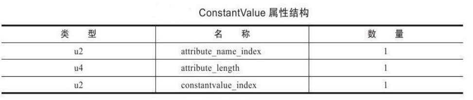
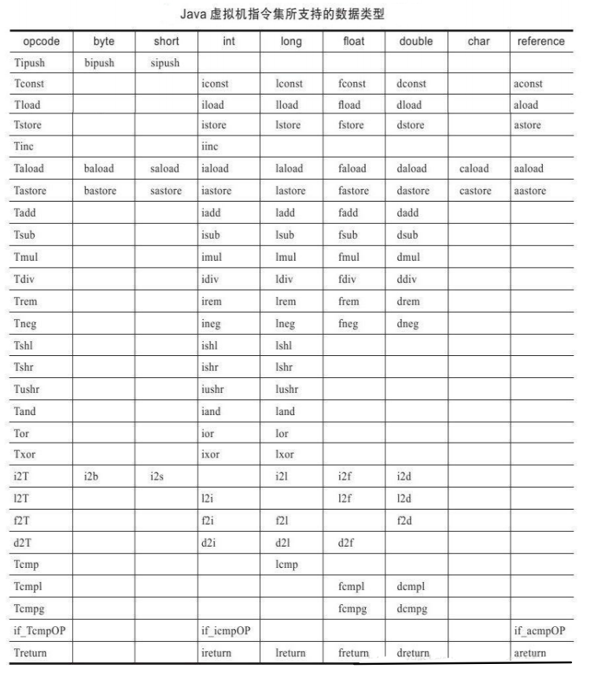
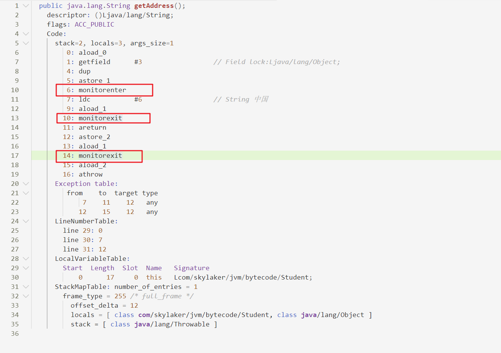

### 类文件结构

#### 1 无关性的基石

* 构成平台无关性的基石：各种不同平台的虚拟机与所有平台都统一使用的程序存储格式——**字节码**（ByteCode）

* Java 虚拟机也可以运行非 Java 语言，做到语言无关性；Java虚拟机不和包括 Java 在内的任何语言绑定，只与 “Class文件” 这种特定的二进制文件格式所关联； 

* Class 文件中包含了 Java 虚拟机指令集和符号表以及若干其他辅助信息；

* 不同语言可以经过编译成 Class 文件：

  

* Java 语言中的各种变量、关键字和运算符号的语义最终都是由多条字节码命令组合而成的，因此字节码命令所能提供的语言描述能力肯定比 Java 语言本身更加强大 。

#### 2 Class 类文件的结构

##### 2.1 基本组成及说明

* 任何一个 Class 文件都对应着唯一一个类或接口的定义信息，但是反过来说，类或接口并不一定都得定义在文件里即不一定以磁盘文件形式存在（例如可以通过类加载器直接生成等）；

* Class 文件是一组以8位字节为基础单位的二进制流，各个数据项目严格按照顺序紧凑地排列在 Class 文件中，中间没有添加任何分隔符；

* 遇到需要占用 8 位字节以上空间的数据项时候，会按照高位在前的方式分割成若干个8位字节进行存储；

* Java虚拟机规范：Class文件格式采用一种类似 C 语言结构体的伪结构来存储数据，这种伪结构只有两种数据类型：**无符号数**和**表**；

  * **无符号数**

    基本数据类型，以 u1、u2、u4、u8 来分别代表 1个字节、2个字节、4个字节和 8个字节的无符号数；

    无符号数可以用来描述数字、索引引用、数量值或者按照UTF-8 编码构成字符串值；

  * **表**

    表是由多个**无符号数**或者其他**表**作为数据项构成的**复**合数据类型，所有表都习惯性地 以“**_info**”结尾。

    表用于描述有**层次关系**的复合结构的数据，整个**Class文件本质上就是一张表**，它由如下数据项构成：

    

    按照上述表格描述，class 文件开头是 4字节的魔数、接下来是2字节+2字节的主次版本号，接下来是常量池……

* Class 字节码文件中的数据项，无论是顺序还是数量，甚至于数据存储的字节 序，都是被**严格限定**的，哪个 

  字节代表什么含义，长度是多少，先后顺序如何，都**不允许改变**。

##### 2.2 测试代码

开始详细学习 Class 字节码文件内容之前，先写一个测试代码编译成 Class 文件，再用 16进制编辑器查看内容，方便后续实时辅助学习：

```java
package com.skylaker.jvm.bytecode;

/**
 * @author skylaker
 * @version V1.0 2020/4/13 20:30
 */
public class Student {
    private int age;

    private String name;

    public Student(){

    }

    public Student(String name){
        this.name = name;
    }

    public int nextYearAge(){
        return this.age + 1;
    }

    public int getAge() {
        return age;
    }

    public void setAge(int age) {
        this.age = age;
    }

    public String getName() {
        return name;
    }

    public void setName(String name) {
        this.name = name;
    }
}

```

使用 WinHex 查看编译后的 class 文件：


##### 2.3 魔数与Class文件版本

* **魔数**

  * 每个Class文件的头4个字节称为**魔数（Magic Number）**：0xCAFEBABE（咖啡宝贝）

  * 它的唯一作用是确定这个文件是否为一个能被虚拟机接受的Class文件。直白点就是标识身份的作用；

  

* **Class文件的版本号**

  * 魔数后面的4个字节存储的是Class文件的版本号：

    第5和第6个字节是**次版本号**（Minor Version）；

    第7和第8个字节是**主版本号**（Major Version）；

  * Java版本号是从45开始 ，JDK 1.1之后的每个JDK大版本发布主版本号向上加1（JDK 1.0～1.1使用了45.0～45.3的版本号）；

  * 示例中 0x00000034，对应十进制 52， 即 对应 JDK8

    

##### 2.4 常量池

* 主次版本号之后的是常量池入口，常量池可以理解为Class文件之中的**资源仓库**； 

* **表**类型数据项目；

* 由于常量池中常量的数量是不固定的，所以在常量池的入口需要放置一项**u2**类型的数 

  据，代表**常量池容量计数值**（constant_pool_count）；容量计数是从1而不是0开始的，

  

  示例中0x0021 , 即十进制 33，代表常量池有32项常量，索引范围 1~32 .

* 常量池存储：主要存放两大类常量：**字面量**（Literal）和**符号引用**（Symbolic References）。 

  * **字面量**比较接近于Java语言层面的常量概念，如文本字符串、声明为final的常量值等。

  * **符号引用**则属于编译原理方面的概念，包括了下面三类常量： 
    * 类和接口的全限定名（Fully Qualified Name） 

    * 字段的名称和描述符（Descriptor） 

    * 方法的名称和描述符；

    Java代码在进行Javac编译的时候，并不像C和C++那样有“连接”这一步骤，在**虚拟机加载Class文件的时候进行动态连接**。也就是说，在Class文件中不会保存各个方法、字段的最终内存布局信息，因此这些字段、方法的符号引用不经过运行期转换的话无法得到真正 的内存入口地址，也就无法直接被虚拟机使用。当**虚拟机运行**时，需要从常量池获得对应的符号引用，再在**类创建时或运行时解析、翻译到具体的内存地址之中**。

    直白点理解就是class文件定义的只是静态的模板信息，具体像对象内存地址这些肯定要程序实际运行的时候才能确定，现在编译的时候肯定不知道，那就先做个标记，后期虚拟机实际运行时候再转换成真正的地址信息等。

* 常量池中每一项常量都是一个表；共有14种常量类型（截止 JDK1.7），这14种表共同的特点：**表开始的第一位是一个u1类型的标志位**（tag，取值见下表标志列），代表当前这个常量属于哪种**常量类型**：

  

  * 这14种常量类型各自均有自己的结构；

  * 其实常量池每一项占据的字节宽度是“固定”的，我们可以通过常量池结构总表来推算出每一项占据的字节数量。

    

    

  

  ​	好比如张三占3个坑，李四占5个坑，那么我们可以从前到后数坑数，第一个发现5个坑，那就是李四……

  ​	

  ​	对于上面的例子我们可以依次推算出每一个常量项，例如第一个 0A 对应第10个 CONATANT_Methodred_info类型，后面是紧跟着方法签名和返回类型索引，分别指向 0x0005 和 0x001c 即第5个和第28个常量项 ，后面的依次类推……

  

  我们可以直接通过 javap -verbose 命令查看字节码内容，可以看下常量池的字节码转义内容：

  

  
  
  项目之一，同时它还是在Class文件中第一个出现的表类型数据项目
  
  * 常量项中其中出现的，如“I”、“V”、“＜init＞”、“LineNumberTable”、 “LocalVariableTable”等;
    * 自动生成的常量；
    * Java代码里面直接出现过
    * 会被字段表（field_info）、方法表（method_info）、属性表（attribute_info）引用
    * 用来描述一些不方便使用“固定字节”进行表达的内容。例如方法返回值、参数。因为Java中的“类”是无穷无尽的，无法通过简单的无符号字节来描述一个方法用到了什么类，因此在描述方法的这些信息时，需要引用常量表中的符号引用进行表达。

##### 2.5 访问标志

* 常量池之后的**两个字节**代表**访问标志**（access_flags），用于**识别类或者接口**层次的访问信息，包括：这个Class是类还是接口；是否定义为public类 型；是否定义为abstract类型；如果是类的话，是否被声明为final等。

* access_flags共有16个标志位可以使用，当前只定义了其中**8个**，没有使用到的标志位要求一律为0

* 具体的标志位以及标志的含义：

  

* 上面我们的代码中类定义只有 public 修饰，且当前使用 JDK1.8编译器编译，因此访问标志应该为： 0x0001 | 0x0020 = 0x0021 , 我们在16进制字节码中也可以对应核实：

  

  

##### 2.6  类索引、父类索引与接口索引集合

* 按顺序排列在访问标志之后；

* 三项数据来**确定类的继承关系**，例如这个类继承了啥父类，实现了啥接口；

* 类索引（this_class）和父类索引（super_class）都是一个**u2**类型的**数据**，而接口索引集合（interfaces）是一组**u2**类型的数据的**集合** ；

* Java 不允许多继承，所以父类索引只有一个；

* 除了java.lang.Object之外，所有的Java类都有父类，因此除了java.lang.Object外，所有Java类的父类索引都不为0 ；

* 类、父类索引用两个u2类型的索引值表示，它们各自指向一个类型为CONSTANT_Class_info的类描述符常量，通过CONSTANT_Class_info类型的常量中的索引值可以找到定义CONSTANT_Utf8_info类型的常量中的全限定名字符串。

  例如上例代码：

  

  ​	类索引指向常量池中索引 4 的常量，父类索引指向索引为5 的常量：

   	

##### 2.7 字段表集合 

* 字段表（field_info）用于描述接口或者类中声明的**变量**；

* 字段（field）包括**类级变量**以及**实例级变量**，但**不**包括在方法内部声明的局部变量；

* **字段表结构**：

  

* **字段修饰符**放在**access_flags**项目中

  * 可包括：

    * 字段的作用域（public、private、protected修饰符）
    * 是实例变量还是类变量（static修饰符）
    * 可变性（final）
    * 并发可见性（volatile修饰符，是否强制从主内存读写）
    * 可否被序列化（transient修饰符）
    * 字段数据类型（基本类型、对象、数组）
    * 字段名称

    

  * 各个修饰符都是布尔值，要么有，要么没有，使用标志位来表示 ;

    字段名字、数据类型，无法固定，引用常量池中的常量来描述；

* **name_index** 和 **descriptor_index**，它们都是**对常量池的引用**，分别代表着**字段的简单名称**以及**字段和方法的描述符**；

  * **全限定名**

    例如上例代码中，“com/skylaker/jvm/bytecode/Student”是这个类的全限定名，仅仅是把类全名中的“.”替换成了“/”而已，为了使连续的多个全限定名之间不产生混淆，在使用时最后一般会加入一 个“；”表示全限定名结束。

  * **简单名称**

    * 指没有类型和参数修饰的方法或者字段名称;

    * 示例代码类中的  nextYearAge() 方法简单名称：nextYearAge ；
    * 示例代码类中的  name 字段简单名称：name；
    * 示例代码类中的  age 字段简单名称：age；

  * **描述符**

    * 用来描述**字段的数据类型**、**方法的参数列表**（包括数量、类型以及顺序）和**返回值**。

    * 根据描述符规则，基本数据类型（byte、char、double、float、int、long、short、boolean）以及代表无返回值的void类型都用一个大写字符来表示，而对象类型则用字符**L**加对象的全限定名来表示，详见 

      

    * 数组类型，每一维度将使用一个前置的“[”字符来描述，如一个定义为 “java.lang.String[][]” 类型的二维数组，将被记录为：“[[Ljava/lang/String；”，一个整型数 组“int[]”将被记录为“[I”

    * 描述符来描述方法时，按照**先参数列表**，**后返回值**的顺序描述，参数列表按照参数的严格顺序放在一组小括号“（）”之内；如方法 `java.lang.String  toString()` 的描述符为 “()Ljava/lang/String；”

* **属性表集合**
  
  在descriptor_index 之后的一个属性表集合用于存储一些额外的信息，字段都可以在属性表中描述零至多项 的额外信息，例如**字段的初始设值信息**（介绍属性表数据项目再详解）
  
* 示例代码

  ****

  开头 0x0002 表示当前有两个字段；

  * 第一个字段的修饰符 0x0002 代表 private ；

    名称指向 0x0006 常量，即 age ;

    字段描述符指向 0x0007 的常量，即 I , 代表字段为 int 类型；

    属性表集合为 0x0000 , 即空；

    

  * 第二个字段的修饰符 0x0002 代表 private ；

    名称指向 0x0008 常量，即 name;

    字段描述符指向 0x0009 的常量，即 I , 代表字段为 String 类型；

    属性表集合为 0x0000 , 即空；

    

##### 2.8 方法表集合

* 方法表的结构如同字段表一样，依次包括了**访问标志**（access_flags）、**名称索引**（name_index）、**描述符索引**（descriptor_index）、**属性表集合**（attributes）几项

  

* 方法表**访问标志**（access_flags）标志位及其取值

  

* 方法里的Java代码，经过编译器编译成字节码指令后，存放在方法属性表集合中一个名为“Code”的属性里面；

* 示例代码

  

  * 第一个u2类型的数据（即是计数器容量）的值为 0x0007，代表集合中有7个方法（需要注意没有声明构造器的时候编译器会默认添加实例构造器<init>）；

  * 下面我们看下第一个方法

    * 方法的访问标志值为0x001，即 ACC_PUBLIC，说明是 public 方法； 

    * 名称索引值为0x000A，查常量池得方法名为“＜init＞”，说明是构造方法；

    * 描述符索引值为 0x000B，对应常量为 “()V”，说明是无参且返回值为 void ；

    * 属性表计数器 attributes_count 的值为0x0001就表示此方法的属 性表集合有一项属性，属性名称索引为0x000C，对应常量为“Code”，说明此属性是方法的字节码描述；

      其实这个 Code 属性就是代表方法中详细内容的字节码指令。

    我们可以对照着反编译的指令码对照着看下：

    

    

* 重载在语言层和字节码层次的区别

  * Java语言重载（Overload）一个方法，名称相同，参数不同，无法通过返回值重载；
  * 在Class文件格式中， 只要描述符不是完全一致的两个方法也可以共存；即两个方法名称相同、参数相同，但返回值不同，那么也是可以合法共存于同一个Class 文件中。

##### 2.9 属性表集合

* Class文件、字段表、方法表都可以携带自己的属性表（attribute_info）集合，以用于描述某些场景专有的信息；

* 各个属性表可以没有严格的顺序，并且只要不与已有属性名重复；

* 任何编译器都可以向属性表中写入自己定义的属性信息，Java虚拟机运行时会忽略掉它不认识的属性；

* Java虚拟机规范预定义了21项虚拟机实现应当能识别的属性（Java SE 7）：

  

  

* 属性表定义的结构

  

  * 第一个名称需要从常量池中引用一个CONSTANT_Utf8_info类型的常量来表示；
  * 第二个为u4的长度属性，说明属性值所占用的位数；
  * 第三个就是对应的详细的属性内容，长度即第二个参数定义的值；

###### 2.9.1 **Code 属性**

* Java程序方法体中的代码经过 Javac 编译器处理，变为字节码指令存储在Code属性内；

* Code属性出现在方法表的属性集合之中；

* 并非所有的方法表都必须存在这个属性，譬如接口或者抽象类中的方法就不存在Code属性；

* Code 属性表结构：

  

  * attribute_name_index是指向CONSTANT_Utf8_info型常量的索引；常量值固定为“Code”，代表了该属性的属性名称；
  * attribute_length指示了属性值的长度；
  * max_stack代表了操作数栈（Operand Stacks）深度的最大值；
  * max_locals代表了**局部变量表**所需的存储空间；
    * max_locals的单位是**Slot**, Slot是虚拟机为局部变量分配内存所使用的最小单位；
    * 对于byte、char、float、int、short、boolean 和returnAddress等长度**不超过32位**的数据类型，每个局部变量占用**1个Slot**；
    * double和long这两种**64位**的数据类型则需要**两个Slot**来存放；
    * 局部变量表存放内容包括：方法参数、显式异常处理器的参数、方法中局部变量；
    * 局部变量表中的**Slot可以重用**，Javac编译器会根据变量的作用域来分配Slot给各个变量使用，然后计算出max_locals的大小，即 max_locals 的值并非为所有局部变量占用 Slot 和；
  * code_length 和 code用来存储 Java 源程序编译后生成的**字节码指令**；
    * code_length代表**字节码长度**；
    * code是用于存储**字节码指令**的一系列**字节流**；
    * 字节码指令，一个u1类型的单字节，取值范围为0x00～0xFF，，Java虚拟机规范已经定义了其中约200条编码值对应的指令含义；
    * code_length，u4类型的长度值，虚拟机规范限制了一个方法不允许超过65535条字节码指令，实际只使用了u2的长度，如果超过这个限制，Javac编译器也会拒绝编译；即不要编写超长的方法；

  * 代码示例：我们直接查看翻译后的字节码内容：

    

    属性名称 Code , 操作数栈最大深度 2， 本地变量表的容量1；参数个数 1 个；

    下面的字节码指令内容含义（Java虚拟机执行字节码是基于**栈**的体系结构）：

    * aload_0：将第0个Slot中为 reference类型的本地变量推送到操作数栈顶，即this当前对象；
    * getfiled  #3 ：获取常量项3指代的变量 age 的值；
    * iconst_1 : 生成常量 1；
    * iadd : 上面两步涉及操作数压栈，这一步进行相加计算；
    * ireturn : 出栈，返回计算出的 int 类型的计算结果；

    其实就是对应我们语言层写的代码：

    ```java
    public int nextYearAge(){
         return this.age + 1;
    }
    ```

  * **显式异常处理表**

    * 在字节码指令之后的 exception** 是这个方法的**显式异常处理表**;

    * 异常表的格式 ：

      

      包含4个字段，字段的含义为：

      * 如果当字节码在第**start_pc**行到第**end_pc**行**之间**（不含第end_pc行）出现了类型为**catch_type**或者其**子类的异常**（catch_type为指向一个CONSTANT_Class_info型常量的索引），则转到第handler_pc行继续 处理；
      * 当catch_type的值为 **0** 时，代表**任意异常情况**都需要转向到handler_pc处进行处理；

    * 异常表实际上是Java代码的一部分，编译器使用**异常表**而不是简单的跳转命令来实现**Java异常**及**finally处理机制**；

      例如我们添加测试代码：

      ```java
      public static int num(){
          int x;
      
          try {
              x = 1;
              return x;
          } catch (Exception e){
              x = 2;
              return x;
          } finally {
              x = 3;
          }
      }
      ```

      编译后的字节码指令内容：

      ```java
        public int num();
          descriptor: ()I
          flags: ACC_PUBLIC
          Code:
            stack=1, locals=5, args_size=1
               0：iconst_1    //try块中的x=1 
               1：istore_1 
               2：iload_1     //保存x到returnValue中，此时x=1 
               3：istore_2 
               4：iconst_3    //finaly块中的x=3 
               5：istore_1 
               6：iload_2     //将returnValue中的值放到栈顶，准备给ireturn返回 
               7：ireturn 
               8：astore_2    //给catch中定义的Exception e赋值，存储在Slot 2中 
               9：iconst_2    //catch块中的x=2 
               10：istore_1 
               11：iload_1    //保存x到returnValue中，此时x=2 
               12：istore_3 
               13：iconst_3   //finaly块中的x=3 
               14：istore_1 
               15：iload_3    //将returnValue中的值放到栈顶，准备给ireturn返回 
               16：ireturn 
               17：astore 4   //如果出现了不属于java.lang.Exception及其子类的异常才会走到这里
               19：iconst_3   //finaly块中的x=3 
               20：istore_1 
               21：aload  4   //将异常放置到栈顶，并抛出 
               23：athrow 
            Exception table:
               from    to  target type
                   0     4     8   Class java/lang/Exception
                   0     4    17   any
                   8    13    17   any
                  17    19    17   any
            LineNumberTable:
              line 28: 0
              line 29: 2
              line 34: 4
              line 29: 6
              line 30: 8
              line 31: 9
              line 32: 11
              line 34: 13
              line 32: 15
              line 34: 17
              line 35: 21
            LocalVariableTable:
              Start  Length  Slot  Name   Signature
                  2       6     1     x   I
                  9       8     2     e   Ljava/lang/Exception;
                 11       6     1     x   I
                  0      24     0  this   Lcom/skylaker/jvm/bytecode/Student;
                 21       3     1     x   I
            StackMapTable: number_of_entries = 2
              frame_type = 72 /* same_locals_1_stack_item */
                stack = [ class java/lang/Exception ]
              frame_type = 72 /* same_locals_1_stack_item */
                stack = [ class java/lang/Throwable ]
      
      ```

      可以看到 finally 执行的方式本质就是在 try 、catch 语句块对应位置放置 finally 中指令内容。

###### 	2.9.2 LineNumberTable属性 

* **行号表属性**用于描述Java源码行号与字节码行号（字节码的偏移量）之间的对应关系；

* 非必须，可以在Javac中分别使用-g：none或-g：lines选项来取消或要求生成这项信息；

* 程序调试断点、异常抛出时显示的行号就是根据这个行号表来的，即查找字节码指令对应的源码行号；

* 结构

  

  其中line_number_table是一个数量为line_number_table_length、类型为line_number_info的集 

  合，line_number_info表包括了**start_pc**和**line_number**两个u2类型的数据项，前者是**字节码行** 

  **号**，后者是**Java源码行号**

* 示例

  

  可以看到行号指示器与我们的源代码是符合的：

  

###### 2.9.3 LocalVariableTable 属性

* **局部变量表**属性用于描述**栈帧**中**局部变量表**中的**变量**与Java**源码**中定义的**变量**之 间的关系；
* 非必须，可在Javac中分 别使用-g：none或-g：vars选项来取消或要求生成这项信息；

* 结构

  

  * 其中，local_variable_info项目代表了一个栈帧与源码中的局部变量的关联，具体结构：

    

    * start_pc和length属性分别代表了这个局部变量的生命周期开始的字节码偏移量及其作用范围覆盖的长度，两者结合起来就是这个局部变量在字节码之中的作用域范围；

    * name_index和descriptor_index都是指向常量池中CONSTANT_Utf8_info型常量的索引，分 

      别代表了**局部变量的名称**以及这个**局部变量的描述符**

    * index是这个局部变量在栈帧局部变量表中**Slot的位置**；

      变量数据类型是64位类型时（double和long），占用的Slot为index和index+1两个；

* 示例

  

###### 2.9.4 ConstantValue属性 

* **常量值属性**的作用是通知虚拟机自动为静态变量赋值；
* 只有被static关键字修饰的变量（类变量）才可以使用这项属性；

* 实例变量或类变量赋值地方

  * 非static类型的变量（也就是**实例变量**）的赋值是在实例构造器**＜init＞**方法中进行的；
  * 对于**类变量**，则有两种方式可以选择：在类构造器**＜clinit＞**方法中或者使用**ConstantValue属性**

  * Sun Javac编译器的选择：
    * 如果同时使用**final**和**static**来修饰一个变量，并且变量的数据类型是**基本类型**或**java.lang.String**的话，就生成**ConstantValue属性**来进行初始化；
    * 如果变量**没被final**修饰，或者**非基本类型及字符串**，会选择在**＜clinit＞**方法中进行初始化；

* 结构

  

  * ConstantValue属性是一个定长属性，它的attribute_length数据项值必须固定为2

  * constantvalue_index数据项代表了**常量池**中一个**字面量常量的引用**；

    字面量可以是CONSTANT_Long_info、CONSTANT_Float_info、 CONSTANT_Double_info、CONSTANT_Integer_info、CONSTANT_String_info常量中的一种；

#### 3 字节码指令

##### 3.1 概述

* Java虚拟机的指令由**一个字节**长度的、代表着某种特定操作含义的数字（称为**操作码**，Opcode）以及跟随其后的零至多个代表此操作所需参数（称为**操作数**，Operands）构成；

  ```java
  操作码 + 操作数
  ```

* 操作码长度限制为一个字节，则指令集的操作码总数不可能超过256条；

* Java虚拟机采用面向**操作数栈**而不是寄存器的架构，所以大多数的指令都不包含操作数，只有一个操作码；

* 简化的Java虚拟机解释器执行模型：

  ```java
  do { 
      自动计算PC寄存器的值加1； 
      根据PC寄存器的指示位置，从字节码流中取出操作码； 
      if（字节码存在操作数）从字节码流中取出操作数； 
      执行操作码所定义的操作； 
  } while（字节码流长度＞0）；
  ```

##### 3.2 字节码与数据类型

* 大部分与数据类型相关的字节码指令，它们的**操作码助记符**中都有**特殊的字符**来表明专门为哪种**数据类型**服务，就是我这个操作码是操作哪种数据类型的数据的：

  | 操作码助记符中的特殊字符 | 对应数据类型数据 |
  | :----------------------: | :--------------: |
  |            i             |       int        |
  |            l             |       long       |
  |            s             |      short       |
  |            b             |       byte       |
  |            c             |       char       |
  |            f             |      float       |
  |            d             |      double      |
  |            a             |    reference     |

  例如 **iload** 指令用于从局部变量表中加载 **int** 型的数据到操作数栈中 ；

* 类似 arraylength 指令，没有代表数据类型的特殊字符，但操作数只能是一个数组类型的对象；

* 无条件跳转指令 goto 则是与数据类型无关的；

* 并非每种数据类型和每一种操作都有对应的指令；

  有一些单独的指令可以在必要的时候用来将一些不支持的类型转换为可被支持的类型

* Java虚拟机所支持的与数据类型相关的字节码指令：

  

  * 大多数对于boolean、byte、short 和char类型数据的操作，实际上都是使用相应的 int 类型作为运算类型（Computational Type）；

##### 3.3 加载和存储指令 

* 加载和存储指令用于将数据在**栈帧**中的**局部变量表**和**操作数栈**之间来回传输；

* 指令分类

  * 将局部变量加载到操作栈

    iload、iload_＜n＞、lload、lload_＜n＞、fload、fload_ ＜n＞、dload、dload_＜n＞、aload、aload_＜n＞

  * 将数值从操作数栈存储到局部变量表

    istore、istore_＜n＞、lstore、lstore_＜n＞、fstore、fstore_＜n＞、dstore、dstore_＜n＞、astore、astore_＜n＞

  * 将常量加载到操作数栈

    bipush、sipush、ldc、ldc_w、ldc2_w、aconst_null、 iconst_m1、iconst_＜i＞、_

    lconst_＜l＞、fconst_＜f＞、dconst_＜d＞。

  * 扩充局部变量表的访问索引的指令

    wide

* 一部分是以尖括号结尾的（例如iload_＜n＞），这些指 令助记符实际上是代表了一组指令（例如iload＜n＞*，它代表了iload_0、iload_1、iload_2和 iload_3这几条指令）

##### 3.4 运算指令 

* 运算或算术指令用于对**两个**操作数**栈上的值**进行某种**特定运算**，并把**结果**重新**存入**到操 

  作**栈顶**；

* 可以分为两种：对**整型数据**进行运算的指令与**对浮点型数据**进行运算的指令

  ```java
  加法指令：iadd、ladd、fadd、dadd。 
  
  减法指令：isub、lsub、fsub、dsub。 
  
  乘法指令：imul、lmul、fmul、dmul。 
  
  除法指令：idiv、ldiv、fdiv、ddiv。 
  
  求余指令：irem、lrem、frem、drem。 
  
  取反指令：ineg、lneg、fneg、dneg。 
  
  位移指令：ishl、ishr、iushr、lshl、lshr、lushr。 
  
  按位或指令：ior、lor。 
  
  按位与指令：iand、land。 
  
  按位异或指令：ixor、lxor。 
  
  局部变量自增指令：iinc。 
  
  比较指令：dcmpg、dcmpl、fcmpg、fcmpl、lcmp。
  ```

* 最接近数舍入模式

  Java虚拟机要求在进行浮点数运算时，所有的运算结果都必须**舍入到适当的精度**，非精确的结果必须舍入为可被表示的**最接近**的精确值，如果有两种可表示的形式与该值一样接 近，将**优先选择最低有效位为零的**

##### 3.6 类型转换指令

* 类型转换指令可以将两种不同的数值类型进行相互转换；

* 一般用于实现用户代码中的**显式类型转换**操作，或者用来处理本节开篇所提到的字节码指令集中数据类型相关指令无法与数据类型一一对应的问题;

* Java虚拟机直接支持（即转换时**无需显式的转换指令**）以下数值类型的宽化类型转换（小范围类型向大范围类型的安全转换） ：

  ```
  int类型到long、float或者double类型
  long类型到float、double类型
  float类型到double类型
  ```

* 窄化类型转换时，必须显式地使用转换指令来完成，包括：

  ```
  i2b、i2c、i2s、l2i、f2i、f2l、d2i、d2l和d2f
  ```

##### 3.7 对象创建与访问指令

* 对象访问指令获取对象实例或者数组实例中的字段或者数组元素

  ```java
  创建类实例的指令：new
  
  创建数组的指令：newarray、anewarray、multianewarray
  
  访问类字段（static字段，或者称为类变量）和实例字段（非static字段，或者称为实例变 量）的指令：getfield、putfield、getstatic、putstatic
  
  把一个数组元素加载到操作数栈的指令：baload、caload、saload、iaload、laload、 faload、daload、aaload
  
  将一个操作数栈的值存储到数组元素中的指令：bastore、castore、sastore、iastore、 fastore、dastore、aastore
  
  取数组长度的指令：arraylength
  
  检查类实例类型的指令：instanceof、checkcast
  ```

* 类实例和数组都是对象，但Java虚拟机对类实例和数组的创建与操作使用了不同的字节码指令

##### 3.8 操作数栈管理指令

* 如同操作一个普通数据结构中的堆栈那样，Java虚拟机提供了一些用于直接操作操作数栈的指令

  ```
  将操作数栈的栈顶一个或两个元素出栈：pop、pop2
  
  复制栈顶一个或两个数值并将复制值或双份的复制值重新压入栈顶：dup、dup2、 dup_x1、dup2_x1、dup_x2、dup2_x2
  
  将栈最顶端的两个数值互换：swap
  ```

##### 3.9 控制转移指令

* 控制转移指令可以让Java虚拟机有条件或无条件地从**指定的位置指令**而不是控制转移指令的下一条指令**继续执行程序**，从概念模型上理解，可以认为控制转移指令就是在有条件或无条件地**修改PC寄存器的值**；

  ```
  条件分支：ifeq、iflt、ifle、ifne、ifgt、ifge、ifnull、ifnonnull、if_icmpeq、if_icmpne、 if_icmplt、if_icmpgt、if_icmple、if_icmpge、if_acmpeq和if_acmpne
  
  复合条件分支：tableswitch、lookupswitch
  
  无条件分支：goto、goto_w、jsr、jsr_w、ret
  ```

* 对于boolean类型、byte类型、char类型和short类型的条件分支比较操作，都是使用**int类型的比较指令**来完成；
* 对于long类型、float类型和double类型的条件分支比较操作，则会**先执行相应类型的比较运算指令**（dcm pg、dcmpl、fcmpg、 fcmpl、lcmp），运算指令会返回一个**整型值**到操作数栈中，随后**再执行int类型的条件分支比较操作**来完成整个分支跳转；

##### 3.10 方法调用和返回指令 

* 方法调用指令与数据类型无关，部分方法调用指令

  ```
  invokevirtual指令用于调用对象的实例方法，根据对象的实际类型进行分派（虚方法分派），这也是Java语言中最常见的方法分派方式。 
  
  invokeinterface指令用于调用接口方法，它会在运行时搜索一个实现了这个接口方法的对象，找出适合的方法进行调用。 
  
  invokespecial指令用于调用一些需要特殊处理的实例方法，包括实例初始化方法、私有方法和父类方法。 
  
  invokestatic指令用于调用类方法（static方法）。 
  
  invokedynamic指令用于在运行时动态解析出调用点限定符所引用的方法，并执行该方法，前面4条调用指令的分派逻辑都固化在Java虚拟机内部，而invokedynamic指令的分派逻辑是由用户所设定的引导方法决定的。
  ```

* 方法返回指令是根据返回值的类型区分的

  ```
  ireturn（当返回值是boolean、byte、char、short和int类型时使用）
  lreturn
  freturn
  dreturn 
  areturn
  return指令：供声明为void的方法、实例初始化方法以及类和接口的类初始化方法使用
  ```

##### 3.11 异常处理指令

* 在Java程序中**显式抛出异常**的操作（**throw**语句）都由 **athrow** 指令来实现

* 在Java虚拟机中，处理异常（**catch**语句）不是由字节码指令来实现的，而是采用**异常表**来完成

##### 3.12 同步指令

* Java虚拟机可以支持**方法级**的同步和**方法内部一段指令序列**的同步，这两种同步结构都 

  是使用**管程（Monitor）**来支持的，即 synchronized 的底层虚拟机支持方式；

* 方法级同步原理及相关逻辑

  * 方法级同步是**隐式**的，即无须通过字节码指令来控制，它实现在方法调用和返回操作之中

  * 虚拟机可以从方法常量池的方法表结构中的**ACC_SYNCHRONIZED**访问标志得知一个方法是否声明为同步方法。

  * 当方法调用时，调用指令将会检查方法的ACC_SYNCHRONIZED 访问标志是否被设置，如果设置了，执行线程就要求**先成功持有管程**，**然后才能执行方法**， 最后当**方法完成**（无论是正常完成还是非正常完成）时**释放管程**。

  * 在方法执行期间，执行线程持有了管程，其他任何线程都无法再获取到同一个管程，即同步互斥；

  * 如果一个同步方法执行期间抛出了异常，并且在方法内部无法处理此异常，那么这个同步方法所持有的管程将在异常抛到同步方法之外时**自动释放**，即方法处理产生异常会自动释放线程持有的锁对象；

  * 例如：

    ```java
    public synchronized int nextYearAge(){
    	return this.age + 1;
    }
    ```

    编译后的字节码内容：

    

* 代码块同步逻辑

  * 同步一段指令集序列通常是由Java语言中的 **synchronized** 语句块来表示的，Java虚拟机的指令集中有 **monitorenter** 和 **monitorexit** 两条指令来支持synchronized关键字的语义
  * 正确实现 synchronized关键字需要Javac编译器与Java虚拟机两者共同协作支持，因为编译器在编译的时候需要插入 monitorenter 和 monitorexit 指令；

  * 例如：

    ```java
    private Object lock = new Object();
    
    public String getAddress(){
        synchronized (lock) {
            return "中国";
        }
    }
    ```

    对应字节码内容：

    

    为了保证在方法异常完成时monitorenter和 monitorexit指令依然可以正确配对执行，编译器会自动产生一个异常处理器，这个异常处理器声明可处理所有的异常，它的目的就是用来执行monitorexit指令。

#### 4 公有设计和私有实现

* Java虚拟机规范描绘了Java虚拟机应有的共同程序存储格式：Class文件格式以及字节码指令集；
* Java虚拟机实现必须能够读取Class文件并精确实现包含在其中的Java虚拟机代码的语义；
* 虚拟机在满足虚拟机规范的约束下可对具体实现做出修改和优化，来让Java虚拟机获得更高的性能、更低的内存消耗或者更好的可移植性；

* 虚拟机实 现的方式主要有以下两种： 

  * 将输入的虚拟机代码在加载或执行时翻译成另外一种虚拟机的指令集。 

  * 将输入的虚拟机代码在加载或执行时翻译成宿主机CPU的本地指令集（即JIT代码生成技术）